# ScreenSnip — User Manual

- **Project:** ScreenSnip.ahk, an AutoHotkey v2 screen capture tool
- **Repository:** https://github.com/kunkel321/ScreenSnip
- **Forum thread:** https://www.autohotkey.com/boards/viewtopic.php?f=83&t=140802
- **Grew out of:** *Snipper* by FanaticGuru — https://www.autohotkey.com/boards/viewtopic.php?f=83&t=115622 — which supplied the original framework and the GDI+ class ScreenSnip still ships unchanged. See [Credits](#21-credits) for the fuller lineage behind both.

ScreenSnip is its own project. It borrows a couple of tools from kunkel321's other work — SettingsManager most obviously — but it is not part of AutoCorrect2, doesn't depend on it, and doesn't need it installed.

---

## Table of contents

1. [What ScreenSnip is](#1-what-screensnip-is)
2. [Installation](#2-installation)
3. [Settings](#3-settings)
4. [Quick start](#4-quick-start)
5. [Capturing](#5-capturing)
6. [Freeze Capture](#6-freeze-capture)
7. [Working with a snip](#7-working-with-a-snip)
8. [Adjusting the capture after the fact](#8-adjusting-the-capture-after-the-fact)
9. [Rotate, Straighten, Flip](#9-rotate-straighten-flip)
10. [Markup: annotating a snip](#10-markup-annotating-a-snip)
11. [Line styles: arrowheads and dashes](#11-line-styles-arrowheads-and-dashes)
12. [Exporting](#12-exporting)
13. [Text extraction: the local engines](#13-text-extraction-the-local-engines)
14. [Text extraction: the AI engine](#14-text-extraction-the-ai-engine)
15. [Imgur uploads](#15-imgur-uploads)
16. [Games: the puzzle modules](#16-games-the-puzzle-modules)
17. [Menu reference](#17-menu-reference)
18. [Keyboard and mouse reference](#18-keyboard-and-mouse-reference)
19. [Things that will bite you](#19-things-that-will-bite-you)
20. [Settings reference](#20-settings-reference)
21. [Credits](#21-credits)

---

## 1. What ScreenSnip is

ScreenSnip captures a region of your screen and leaves it floating on the desktop as a borderless, always-on-top window. You can have as many of these snips open at once as you like.

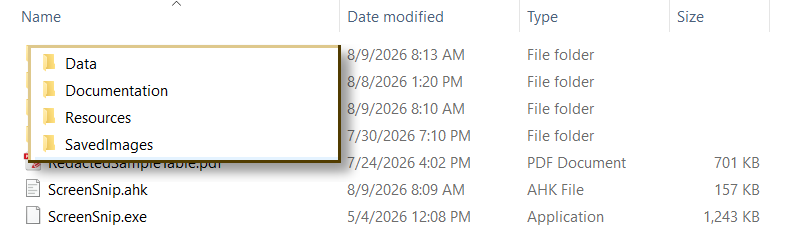

That "floating window" part is the whole point. Most capture tools hand you a file or a clipboard blob and get out of the way. ScreenSnip instead gives you a persistent visual reference you can park next to whatever you're working on — a phone number from an email while you fill in a form, a chart from one PDF while you write about it in another, a config value from a webpage that keeps scrolling away.

Six things it does that the built-in Windows tools don't:

**It keeps a frozen snapshot around the edges of your capture.** When you drag a selection, ScreenSnip actually grabs a rectangle several hundred pixels larger than what you asked for and keeps it in memory. So if you clip the bottom of a sentence, you don't re-snip — you drag the snip's bottom edge down and the missing pixels are already there. Nothing on screen has to still be showing.

**It can capture things that vanish when you click.** Context menus, tooltips, and drop-downs all close the moment a mouse button goes down, which makes them impossible to capture with a drag gesture. Freeze Capture solves this with a keyboard trigger that photographs the entire desktop first, then lets you select from that still image.

**It can grab a whole window with one click.** During a Freeze Capture, hovering highlights the window under the cursor and a left-click takes it — no aiming at corners, no trimming afterwards.

**It reads text out of the capture — three different ways.** Two OCR engines run locally: a fast built-in Windows one, and PaddleOCR for harder material. A third path sends the image to an AI vision model, which is the only one of the three that can see a table's *ruling lines*. All of them put their result on the clipboard.

**Its annotations stay editable.** Arrows, boxes, numbered badges, text labels, highlighter, redaction blur — none of it is painted into the image. Every object stays selectable forever, so you can recolour an arrow you drew ten minutes ago, and the annotations follow the pixels they were drawn on when you pan, resize, rotate or flip the snip. See [section 10](#10-markup-annotating-a-snip).

**It will cut your screenshot into a puzzle,** which is either the least necessary feature in the package or the best one, depending on the day. See [section 16](#16-games-the-puzzle-modules).

A short animated demo lives beside this manual as [`ScreenSnipDemo.gif`](ScreenSnipDemo.gif).

---

## 2. Installation

### The portable approach

ScreenSnip is distributed as a script, not a compiled executable. The repository convention — shared across all of kunkel321's ahk apps — is a **renamed copy of `AutoHotkey64.exe`** sitting next to the `.ahk` file.

Copy `AutoHotkey64.exe` into the ScreenSnip folder and rename it `ScreenSnip.exe`. When you run it, AutoHotkey looks for a script with its own name in its own folder and runs `ScreenSnip.ahk`. Nothing is compiled, so edits to the `.ahk` take effect on the next launch, and the whole folder stays portable — you can drop it on a flash drive and it works on a machine with no AutoHotkey installed.

You can also just run `ScreenSnip.ahk` directly if you have AutoHotkey v2 installed. The renamed-exe trick is about portability, not necessity.

### Folder layout

The top-level folder holds only the script and its exe. Everything else is in a subfolder, and the split is by **who writes it**:

```
ScreenSnip\
├─ ScreenSnip.ahk               the script
├─ ScreenSnip.exe               renamed copy of AutoHotkey64.exe
│
├─ Resources\                   shipped — ScreenSnip never writes here
│   ├─ SnipOCR.ahk              local OCR module
│   ├─ OCR.ahk                  Descolada's Windows OCR library
│   ├─ PaddleOCR-json\          the offline OCR engine + its models
│   ├─ SnipAI.ahk               AI vision module
│   ├─ SnipImgur.ahk            Imgur upload module
│   ├─ SnipWinDetect.ahk        window highlighting for Freeze Capture
│   ├─ SnipMarkup.ahk           annotation / markup layer
│   ├─ SnipPuzzle.ahk           slide and swap tile puzzles
│   ├─ SnipJigsaw.ahk           jigsaw puzzle
│   ├─ ToolTipOptions.ahk       just me's tooltip styling library
│   ├─ SettingsManager.ahk      the settings editor
│   └─ SettingsManager.exe      renamed copy of AutoHotkey64.exe
│
├─ Data\                        settings and everything written at runtime
│   ├─ snipSettings.ini         every setting — see section 3
│   ├─ snipSettingsMetadata.json  labels, help text, types and ranges
│   ├─ ApiKeys.ini              Imgur Client ID + OpenAI API key — KEEP PRIVATE
│   ├─ ScreenSnip_error.log     written only if something throws
│   └─ (OCR / AI debug dumps)   only when a Debug setting is on
│
├─ Documentation\
│   ├─ ScreenSnip-Manual.md     this file
│   ├─ ScreenSnipDemo.gif
│   └─ Images\
│
└─ SavedImages\                 a handy target for Save Image As…
```

`Resources\` is inert: ScreenSnip reads from it and never writes to it. Everything that ScreenSnip or SettingsManager writes goes in `Data\` instead — your settings, your API keys, the error log, and any debug dumps.

There is one deliberate exception, and it's worth knowing about: the markup module's **Line Styles** editor and its **Save as default** button write back into `Data\snipSettings.ini`. That's still the Data folder, not Resources — but it means the INI is not purely something you edit from outside. See [section 11](#11-line-styles-arrowheads-and-dashes).

**The one file that must stay private is `ApiKeys.ini`.** Neither value in it is a password, but the Imgur Client ID is rate-limited against your account and the OpenAI key spends your prepaid credit. If ScreenSnip lives in a git repository, that is the file to add to `.gitignore`.

`Data\` is created on first use. If the install folder is read-only, ScreenSnip falls back to writing beside the script rather than throwing an error on every OCR run.

Deleting `Data\snipSettings.ini` is a safe factory reset — see [section 3](#3-settings) for why.

`SavedImages\` is purely a convention. The first folder offered by Save Image As… comes from the `SaveDefaultFolder` setting (your Pictures folder as shipped), and after that the last folder you actually saved to wins for the rest of the session.

Paths in this manual are given relative to the ScreenSnip folder. Note that in AHK v2 a relative `#Include` resolves against the folder of the *file containing the directive*, not the working directory — which is why `SnipOCR.ahk`'s own `#Include OCR.ahk` finds Descolada's library sitting beside it in `Resources\` with no path of its own.

### The add-on modules

Every add-on is optional and every one is included the same way, from the bottom of `ScreenSnip.ahk`:

```ahk
#Include *i Resources\SnipOCR.ahk
#Include *i Resources\SnipAI.ahk
#Include *i Resources\SnipImgur.ahk
#Include *i Resources\SnipWinDetect.ahk
#Include *i Resources\SnipPuzzle.ahk
#Include *i Resources\SnipJigsaw.ahk
#Include *i Resources\SnipMarkup.ahk
#Include *i Resources\ToolTipOptions.ahk
```

The `*i` flag means "include only if the file exists." Delete any module — or comment out its line — and ScreenSnip still runs; the feature's menu items are simply left off.

| Module | Sentinel class | What it adds | What it needs |
|---|---|---|---|
| `SnipOCR.ahk` | `OcrCfg` | OCR → Copy Text (Windows) · Copy Text (PaddleOCR) · Copy Table (PaddleOCR) | `Resources\OCR.ahk` and/or `Resources\PaddleOCR-json\` |
| `SnipAI.ahk` | `SnipAiCfg` | OCR → Copy Text (AI) · Copy Table (AI) · Ask AI About Snip… | An OpenAI API key. **Paid, and the image leaves your machine** |
| `SnipImgur.ahk` | `Imgur` | Imgur submenu + the Uploader dialog | A free Imgur account and Client ID |
| `SnipWinDetect.ahk` | `WinDetectCfg` | Window highlighting during Freeze Capture | Nothing. No setup at all |
| `SnipMarkup.ahk` | `MarkupCfg` | The Markup submenu, the tool pallet, and every annotation type | Nothing. No setup at all |
| `SnipPuzzle.ahk` | `PuzzleCfg` | Games → Slide Puzzle · Swap Puzzle | Nothing. No setup at all |
| `SnipJigsaw.ahk` | `JigCfg` | Games → Jigsaw Puzzle | Nothing. No setup at all |
| `ToolTipOptions.ahk` | `ToolTipOptions` | Readable tooltips — font, colors, padding | Nothing. No setup at all |

`SettingsManager` is optional on the same terms but isn't `#Include`d — it's a separate program that ScreenSnip launches. Absent from `Resources\`, the two **Settings…** menu items are simply never added. See [section 3](#3-settings).

Three of those combine rather than stack. If **neither** `SnipOCR.ahk` nor `SnipAI.ahk` is present, the OCR submenu is omitted entirely rather than left on the menu empty. Likewise the **Games** submenu appears if *either* puzzle module is present and disappears when both are gone — `SnipPuzzle.ahk` and `SnipJigsaw.ahk` are independent of each other and share no code, so either can be deleted without touching the other.

The mechanism behind the "sentinel class" column is worth one paragraph, because it explains an oddity you'll notice in the source. Each module declares a class, and ScreenSnip tests for it with `IsSet()` before building any menu or calling any function that depends on it. Class objects are created at load time, *before* the auto-execute section runs, regardless of where in the file the class is declared — which is why an `IsSet(OcrCfg)` test near the top of the script can see a class declared in a file that isn't `#Include`d until 3,000 lines further down. Calls into the modules then go through the `%name%()` dynamic form, because a *direct* call to a function that might not exist is a load-time error in v2, which would defeat the whole arrangement.

`ToolTipOptions.ahk` is the one exception to that dynamic-call rule, and it's instructive rather than inconsistent: everything it exposes is a *method on the sentinel class itself*, so `ToolTipOptions.Init()` is a variable dereference followed by a method call. An unset variable is a runtime matter, not a load-time error, so no dance is needed.

### Upgrading from an older install

Older versions kept everything in one flat folder and stored the Imgur Client ID in `ImgurClientID.ini` beside the script. On first use, ScreenSnip migrates that ID into `Data\ApiKeys.ini` and renames the original to `ImgurClientID.ini.bak`. Nothing is destroyed, and downgrading to an older ScreenSnip still works.

If the migration fails — read-only folder, file in use — ScreenSnip keeps reading the legacy file so uploads carry on working.

### Starting with Windows

Two options, and which one you want depends on whether you need to capture elevated windows.

**Tray menu → Start with Windows** creates a shortcut in your Startup folder. Simple, works fine, and ScreenSnip will run at normal integrity.

**Task Scheduler with "Run with highest privileges"** is what you need if you want to snip elevated applications. See [section 19](#19-things-that-will-bite-you) for why. A Startup-folder shortcut to an elevation-requesting program is silently skipped by Windows at logon, so the Startup folder is not a route to running elevated — Task Scheduler is.

---

## 3. Settings

Every configurable value in ScreenSnip and its add-on modules lives in one file:

```
Data\snipSettings.ini
```

It's a plain INI, so any text editor will do. But the intended way in is **SettingsManager**, reachable from either menu:

- **Tray menu → Settings…**
- **Right-click a snip → Settings…**

Both items are present only when `Resources\SettingsManager.exe` (or `SettingsManager.ahk`) exists. Delete it and they vanish rather than sitting there dead.

### Why an editor rather than a config block

ScreenSnip used to keep its settings in a long commented block at the top of the script, and each setting's explanation sat in a comment beside it. Those explanations have moved into `Data\snipSettingsMetadata.json`, which supplies SettingsManager's labels, help text, value types, and valid ranges.

That is the entire point of the move: the guidance is now **in front of the person changing the setting**, in a help pane that updates as you select each item, instead of in a source file they may never open. If you want to know what something does, select it in SettingsManager and read the pane. This manual's [settings reference](#20-settings-reference) is a map of the file, not a replacement for that help text.

### Three things to know about how it loads

**Settings are read once, at launch.** Nothing re-reads the file, so a change takes effect on the next start. SettingsManager offers a restart after you save; take it. Note that restarting closes any snips you have open, so finish with them first.

The two exceptions are both in the markup module, and both are deliberate: the `[MarkupCaps]` and `[MarkupDashes]` sections are re-read on demand so the Line Styles editor can work without a restart, and the pallet's **Save as default** button updates the running defaults as well as the file. Everything else needs the restart.

**Deleting `snipSettings.ini` is a safe factory reset.** Every setting is read through a helper that carries a coded fallback, so a missing file, a missing key, or a blank value all quietly produce the built-in default. The script starts normally and behaves as shipped.

**A corrupt or locked file degrades rather than breaks.** The whole load is wrapped so that a malformed INI fails to an empty set of values, which means every setting falls back and ScreenSnip still runs. That matters more than it sounds: the add-on modules ask for their settings during class initialisation, which happens *before* the main script's first line executes, so an exception there would be a load-time failure — ScreenSnip simply wouldn't start.

One consequence of that ordering is worth knowing if you go poking at the source. The settings cache is deliberately lazy, filled by whichever caller asks first, precisely because the modules at the bottom of the file ask before the settings block at the top has run.

### File conventions

| Convention | |
|---|---|
| Booleans | `1` = on, `0` = off |
| Colors | Six hex digits, `RRGGBB`, no `0x` and no `#` |
| Line breaks in text | `` `n `` — the script converts it to a real break |
| Relative paths | Resolved against the ScreenSnip folder |
| `%USERPROFILE%` | Expanded in path settings |

A value's *type* follows its fallback rather than the file: a setting whose default is `250` comes back as an integer, one whose default is `0.55` comes back as a float, and one whose default is text comes back as text. Type something non-numeric where a number belongs and that key falls back rather than producing nonsense. The same is true of colors — anything that isn't six valid hex digits is rejected, which stops a typo'd `TransColor` from punching holes in every snip.

### Tooltip appearance

ScreenSnip reports OCR results, AI progress, upload status, markup status messages, and the Freeze Capture window readout through Windows tooltips. Left plain, those are small, pale yellow, and hard to read against a busy screenshot — which is a poor fit for a message you're meant to glance at and act on.

`Resources\ToolTipOptions.ahk`, by AHK forum member **just me**, fixes that. It is an unmodified copy of his library, dropped in as-is so it can be replaced wholesale whenever he posts an update. The `[Tooltips]` section of the INI feeds it a font, a size and style, foreground and background colors, four margins, and an optional title with an icon.

The clever part is *how* it applies: it subclasses the tooltip window class rather than wrapping the `ToolTip()` function. **No call site anywhere changes.** Every `ToolTip()` in every module, present and future, is styled or not depending only on whether that one file exists. Delete it and they all fall back to the plain Windows tooltip, with nothing else to undo.

Two defaults are worth noticing. `TipBackColor` and `TipTextColor` fall back to the Freeze Capture hint's colors, so the hint pill and the status tooltips read as one visual family unless you deliberately separate them. And `EnhanceToolTips=0` turns the styling off while leaving the file in place, which is the setting to reach for if you'd rather have system-standard tooltips than delete anything.

If a tooltip setting is invalid — a typo'd style word, a size outside 1–255 — ScreenSnip says so once, undoes any half-applied styling, and carries on with plain tooltips for that session. You get consistently plain rather than, say, huge but still pale yellow.

The Freeze Capture hint pill is **not** a tooltip, incidentally. It's a window of its own, configured separately under `[FreezeHint]`.

---

## 4. Quick start

1. Launch ScreenSnip. A scissors icon appears in the system tray.
2. Hold **Ctrl** and **right-click-drag** a rectangle around something on screen.
3. Release. The captured region is now a floating window.
4. **Left-drag** it wherever you want it.
5. Press **Esc** while it's focused to close it, or **F1** for the full hotkey list.

That's the core loop. Everything else in this manual is refinement.

Three shortcuts worth learning immediately: add **Shift** to the capture drag (`Ctrl+Shift+RButton`) to also copy the image to the clipboard, double-tap **CapsLock** to start a [Freeze Capture](#6-freeze-capture), and press **M** on a focused snip to start [annotating it](#10-markup-annotating-a-snip).

---

## 5. Capturing

### The normal drag

Hold `Ctrl` and drag with the **right** mouse button. A translucent overlay follows your drag, with width and height labels in the corner once the selection is big enough to fit them.

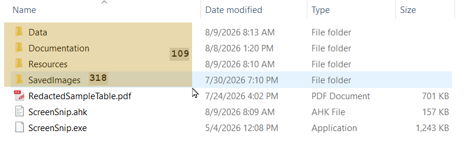

The labels appear at 75 px wide for the W label and 55 px tall for the H label — below that they'd overlap the selection itself.

Release to create the snip. Selections smaller than 8×8 px are discarded, so a stray Ctrl+right-click won't litter your desktop with tiny snips.

Add `Shift` to also drop the image on the clipboard as you capture.

**Why the right button?** Left-drag is the universal "select things" gesture and is claimed by nearly every application. Right-drag is not, so ScreenSnip can take it without fighting anything.

### Show / hide everything

`Shift+PrintScreen` toggles all open snips at once. This is more useful than it sounds — it's how you take a screenshot *of* your desktop without a dozen snips cluttering it, and how you check what's underneath a snip without moving it.

The snips aren't closed, just hidden. Press it again and they all come back where they were.

---

## 6. Freeze Capture

### The problem

Try to capture a context menu with a normal drag and you can't. Pressing a mouse button dismisses the menu, so by the time the drag starts there's nothing left to capture. The same goes for tooltips, drop-down lists, and anything else that closes on a click elsewhere.

### The solution

Freeze Capture is triggered by a **key**, not a click. The instant you press it, ScreenSnip BitBlts the entire virtual desktop into memory and puts up a full-screen backdrop showing that frozen image. The real menu is then free to close — its pixels are already captured.

You then right-drag a selection on the frozen image exactly as you normally would. The snip is cut from the bitmap, never re-read from the screen.

A pleasant consequence of that design: anything ScreenSnip itself floats over the backdrop — the hint message, the dimension labels, the selection rectangle, the window outline — is invisible to the capture by construction. There's no need for the code to hide its own UI before grabbing, because the grab already happened. The one rule that keeps this true is that nothing is ever re-grabbed from the screen after the initial freeze.

### Window highlighting

With `SnipWinDetect.ahk` present, a freeze does more than hold still. Move the mouse and the window beneath the cursor is outlined in blue, with a small readout beside the cursor giving its title, its window class, and its size. Left-click and you get that window whole.

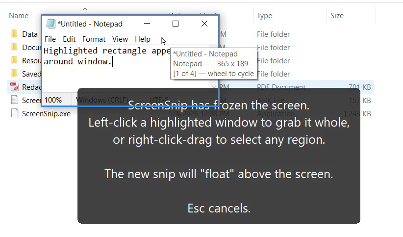

| Gesture | Result |
|---|---|
| Move the mouse | Highlight the window under the cursor |
| **Left-click** | Capture the highlighted window whole |
| **Wheel up / down** | Cycle to a window stacked underneath this one |
| Right-drag | Freehand region selection, exactly as before |
| `Esc` | Cancel |

When more than one candidate sits under the cursor, the readout shows a position — `[1 of 4] — wheel to cycle` — so you know there's something behind the thing you're pointing at. Each monitor is offered as a candidate too, appended to the *end* of the list. That ordering does three jobs at once: a real window under the cursor always wins, a whole screen is always one wheel-step past the last window, and hovering over empty desktop still highlights something.

**This is not image analysis.** The frozen backdrop is only a picture laid over the desktop — the real windows are still sitting underneath it at the same coordinates, so the window tree can simply be queried. SnagIt does the same thing. Freeze mode is in fact the ideal case for it: because the screen is frozen, nothing can move, so the entire top-level window list is snapshotted *once* when the freeze begins and every mouse-move afterwards is just an in-memory rectangle test. No API calls while hovering, so it stays smooth, and no chance of a window shifting between the moment it was highlighted and the moment it was captured.

Two details you may notice:

**The outline hugs the visible window, not the invisible one.** Most windows carry an invisible resize border down the left, right, and bottom that `GetWindowRect` reports as part of the window. Capturing that rect would drag a strip of whatever is behind the window into the snip, so the true visual bounds are used instead.

**The wheel is bound only during a freeze.** A permanently registered `WheelUp` would put ScreenSnip in the mouse-hook chain for every scroll on the machine, so the two wheel hotkeys are registered when the freeze starts and unregistered when it ends. They're also *suppressing* rather than pass-through, on purpose: the screen is frozen, and letting the wheel through would scroll the real window underneath while the backdrop kept showing the old pixels — the snip you finally cut wouldn't match what you saw.

Scope is **top-level windows only**. Child controls — toolbars, list panes, individual buttons — would need per-control enumeration, and modern apps (Chrome, Electron/VSCode, UWP, WPF) draw everything inside a single HWND and would need UI Automation on top of that. Neither is attempted. For anything smaller than a window, right-drag a region.

Delete `SnipWinDetect.ahk` and all of this goes away cleanly: no highlighting, no wheel binding, and the hint pill reverts to wording that doesn't advertise a click that does nothing.

### Using it

| Action | Result |
|---|---|
| Double-tap `CapsLock` (default) | Freeze the screen |
| Left-click a highlighted window | Grab it whole |
| Right-drag on the frozen image | Select a region |
| Hold `Shift` when you release | ...and copy to clipboard |
| `Esc` | Cancel, unfreeze, capture nothing |

The tray menu also has a **Freeze Capture** item. It's a discoverable way in for anyone who never reads the config block, and a fallback when another script has won the race for the trigger key.

### Choosing a trigger key

The trigger is set by `FreezeCaptureKey` in the `[FreezeCapture]` section of the settings. It ships as `CapsLock`, with `FreezeDoublePress` on.

The double-press default exists for a specific reason. The hotkey is registered with `~` (pass-through), so the key keeps doing its normal job. On a toggle key like CapsLock or ScrollLock, two presses turn the lock on and then straight back off — net effect zero, lock state untouched. A single-press trigger on the same key would leave CapsLock stuck on every time you used it.

Candidate keys, with the tradeoffs:

- **`ScrollLock`** — arguably the best choice. Almost nothing uses it, it has a status LED, and no application will fight you for it.
- **`CapsLock`** — fine *if* no other AHK script already claims CapsLock. Each script installs its own keyboard hook, and if a hook earlier in the chain consumes the key, ScreenSnip never sees it.
- **`PrintScreen`** — the conventional choice, but SnagIt and Windows 11's Snipping Tool both grab it. Only viable if nothing else on your machine wants it.

Set `FreezeCaptureKey := ''` to disable the built-in trigger entirely.

### The cross-script trigger

If another script already owns the key you'd like to use, don't fight over it. ScreenSnip listens for a registered window message and will start a Freeze Capture whenever it arrives. `RegisterWindowMessage` returns the same ID in every process for a given string, so no shared file and no hard-coded number is needed.

From the script that owns the key:

```ahk
~CapsLock:: {
    static lastTick := 0, msg := DllCall('RegisterWindowMessage'
                                , 'Str', 'AHK_ScreenSnip_FreezeCapture', 'UInt')
    if (A_TickCount - lastTick <= 400) {
        lastTick := 0
        try PostMessage(msg, 0, 0, , 'ahk_id 0xFFFF')
    } else
        lastTick := A_TickCount
    SetCapsLockState('Off')      ; whatever that script normally does
}
```

This is a harmless no-op when ScreenSnip isn't running, so it can live in a library unconditionally.

### The CapsLock nullify option

`FreezeNullifyCapsLock` (default `true` in the shipped config) switches CapsLock back off after *every* press, single or double, so a stray press can't leave it on. It only takes effect when `FreezeCaptureKey` is actually `CapsLock`, so it can't surprise someone who chose a different key.

The hotkey is non-suppressing either way, so other scripts' CapsLock bindings still fire — only the lock *state* is reset afterwards. If you have another script that reads the caps state rather than just hotkeying on the key, leave this false.

---

## 7. Working with a snip

A snip is an ordinary window as far as your mouse is concerned — click it to focus it, and the hotkeys in this section apply to whichever snip is focused.

### Mouse gestures

| Gesture | Effect |
|---|---|
| Left-drag | Move the window |
| Drag an edge or corner | Resize the capture region — trim or grow |
| Right-drag | Pan the image within the frame (hand-tool style) |
| `Alt` + right-drag | Resize by cursor travel — top-left stays put |
| Right-click | Context menu |
| `Alt` + wheel | Transparency ± 10 |
| `Ctrl` + click an annotation | Select it, and open markup if it isn't already open |

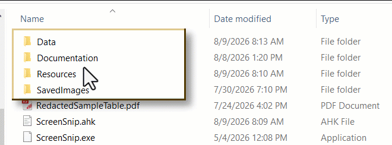

Right-drag has a small dead zone at the start (`PanClickSlop`, 5 px) so that a plain right-click opens the menu instead of nudging the image a pixel. Drag further than that and it becomes a pan.

Pan sensitivity is set by `PanDragDivisor` (default 3), meaning three pixels of mouse travel move the image one pixel. That sounds sluggish until you try to nudge a single row of text into view, at which point it's exactly right. Set it to 1 for 1:1 tracking. The fractional remainder is carried between frames, so slow drags move smoothly rather than stair-stepping.

### The two ways to resize with the mouse

**Grab an edge.** Hover within `EdgeGrabZone` px of any edge or corner and the pointer turns into a resize arrow; drag and the opposite edge stays anchored. No modifier needed — the cursor tells you it's live. (During a markup session the frame is the snip's drag-to-move handle instead, so edge resizing wants `Alt` there and the cursor stays a plain arrow to match. See [section 10](#10-markup-annotating-a-snip).)

**`Alt` + right-drag anywhere.** The visible top-left corner is nailed down and the size follows your cursor travel, divided by `ResizeDragDivisor` (default 3). This is the same feel as MoveResizeTools, and it's the gesture to use when the snip is small enough that aiming at a 6 px edge band is annoying. Because the size is recomputed from the *start* of the drag each frame rather than accumulated, putting the cursor back where you began puts the snip back at its original size exactly.

Plain right-drag still pans, so the two never collide. Alt is also the unambiguous override during markup: `Alt`+press on an edge resizes even when a drawing tool would otherwise take the click.

**A snip never scales.** It is always 1:1 with the pixels that were captured, so "resize" here always means re-cropping the frozen master — see [section 8](#8-adjusting-the-capture-after-the-fact). Grow past the master's edge and the resize simply stops. If another tool resizes a snip window from the outside, ScreenSnip notices and re-crops to match rather than stretching the image.

### The border and bevel

Each snip gets a colored border (`ShowSnipBorder`, `BorderColor`, `BorderThickness`) with an optional 3D bevel — lighter on the top and left, darker on the bottom and right, both derived from the border color.

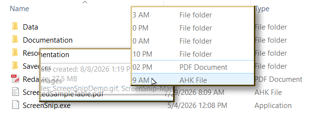

The **focused** snip's bevel is drawn at full strength; unfocused snips are dimmed by `Bevel3DInactiveDarknessFactor`. Same shape, same contrast, just darker overall. It's a focus cue that doesn't require a second border color.

The bevel is automatically disabled above `Bevel3DMaxThickness` (default 3 px), because thick beveled frames look chunky.

The border's colour and width are per-snip and can be changed on the fly — `Ctrl`+click the frame during a markup session and the pallet's swatches and Width box edit the frame instead of an object. That's covered in [section 10](#10-markup-annotating-a-snip), because the frame behaves like one more annotation once you're in there.

### The drop shadow

Each snip can cast a soft translucent shadow down and to the right. It's a separate click-through window glued to the snip via `WM_WINDOWPOSCHANGED` — the snip window itself is never touched, which is what keeps the geometry code from having to know about shadows at all.

Like the bevel, the shadow participates in the focus cue: `ShadowOffset` for the active snip, `ShadowOffsetInactive` (smaller) for the rest, so the focused snip appears to lift forward off the desktop.

The shadow is suppressed automatically in two cases: at skewed or non-cardinal angles (a rectangular shadow behind a tilted snip looks wrong), and whenever the snip isn't fully opaque (a shadow behind a see-through window is incoherent).

Toggle it per-snip from the right-click menu.

### Transparency

`Alt+Up` / `Alt+Down` steps opacity by 25; `Alt+wheel` steps by 10. Useful for tracing — drop a snip to half opacity over a document and you can see both at once.

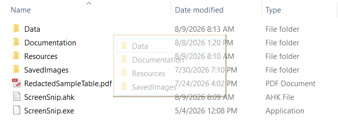

Remember the shadow disappears below full opacity. That's intentional, not a bug. Resizing a semi-transparent snip also flickers where an opaque one doesn't, for related reasons — the smooth-resize path drops the layered-window style, and a transparent snip has to keep it.

---

## 8. Adjusting the capture after the fact

This is ScreenSnip's most distinctive feature, and the one most worth understanding properly.

### How it works

When you drag a selection, ScreenSnip doesn't capture just that rectangle. It captures a **frozen master snapshot** extending `CaptureAdjustMargin` pixels (default 250) beyond your selection in every direction, and keeps it in memory for the life of the snip.

What you see in the floating window is a crop of that snapshot. So "adjusting the capture" is really just moving the crop rectangle around inside an image you already have. The screen behind it can have scrolled, closed, or changed entirely — irrelevant. Nothing is ever re-read from the screen.

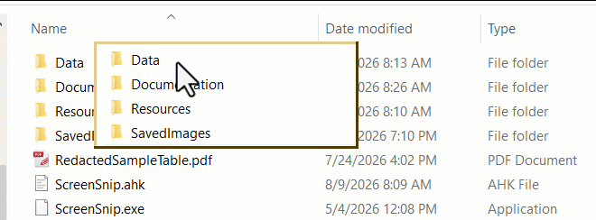

### Panning the region

Moves the crop over the snapshot. The frame stays put; different pixels show through it.

| Keys | Step |
|---|---|
| `Ctrl+Alt+Arrow` | 1 px |
| `Ctrl+Shift+Alt+Arrow` | 10 px |
| Right-drag | Continuous |

### Resizing the region

Grows or shrinks the crop. The frame changes size to match.

| Keys | Step |
|---|---|
| `Win+Alt+Arrow` | 1 px (Right/Down grow) |
| `Win+Shift+Alt+Arrow` | 10 px |
| Drag an edge/corner | Continuous, opposite edge stays put |
| `Alt` + right-drag | Continuous, top-left stays put |

### The margin tradeoff

`CaptureAdjustMargin` is the maximum you can pan or grow in any direction before you hit the edge of the snapshot. Bigger margin, more headroom — but a 32-bit bitmap costs `width × height × 4` bytes, and that's per snip.

- `0` — no headroom. The region is fixed at exactly what you selected.
- `150` — comfortable for fixing small clipped edges.
- `250` — the shipped default.
- `99999` — effectively snapshots the entire desktop into every snip.

Oversized values are safe: the number is clamped to the virtual desktop bounds, so you get "everything" and higher RAM use rather than a crash.

Note that Straighten also draws on this margin (see below), so if you deskew a lot, a larger margin buys you more clean rotation before the corners run past the snapshot edge.

### Distinguishing the three "move" operations

Easy to conflate, so:

| Operation | What moves | Keys |
|---|---|---|
| **Nudge window** | The floating window, on your desktop | `Ctrl+Arrow` |
| **Pan region** | The crop, over the frozen snapshot | `Ctrl+Alt+Arrow` |
| **Resize region** | The crop's size | `Win+Alt+Arrow` |

Nudging changes nothing about the image. Panning and resizing change what the image *is*. Annotations, if there are any, are stored against the snapshot rather than the window — so panning slides the image *and* its arrows together, and shrinking the region clips them at the frame edge instead of squashing them.

---

## 9. Rotate, Straighten, Flip

### Rotate

Turns the **whole snip, frame and all**. The window itself becomes a rotated rectangle.

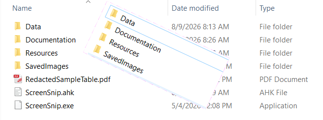

| Keys | Effect |
|---|---|
| `Alt+Left` / `Alt+Right` | ± 1° |
| `Shift+Alt+Left` / `Right` | Snap to the next 30° |
| Menu → Rotate | 90° CW, 180°, 90° CCW |

At angles other than 0/90/180/270 the border is suppressed and the corners are keyed out with magenta (`TransColor`, `0xFF00FF` — chosen because that exact value essentially never occurs in a real screenshot). See [section 19](#19-things-that-will-bite-you) for the known halo artifact.

### Straighten (deskew)

Tilts the **image inside a fixed rectangular frame**. The frame stays axis-aligned; only the content rotates.

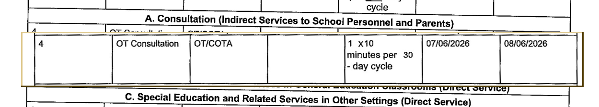

| Keys | Effect |
|---|---|
| `Alt+,` / `Alt+.` | ± 1° (CCW / CW) |
| `Shift+Alt+,` / `.` | ± 0.5°, fine |
| Menu → Straighten → Reset | Back to level |

Clamped to `StraightenMaxAngle` (15°), though in practice the margin runs out first.

**The main use case is squaring up a skewed table before OCR.** A photographed or scanned table that sits a couple of degrees off level confuses the row-and-column clustering badly. Straighten it, then drag an edge to trim the exposed corners, then run Copy Table.

The pivot behaviour is subtle but deliberate: content rotates about the centre of the crop *as it was when you began straightening*, and that pivot is then held fixed until you return to level. This means you can pan around afterwards and the frame slides over one stable rotated image — no swirling — while the tilt itself still turns about what you were actually looking at.

### Flip

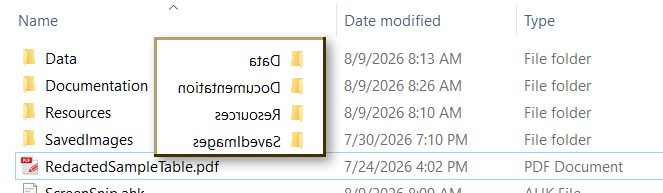

| Keys | Effect |
|---|---|
| `Shift+Left` / `Shift+Right` | Flip horizontal |
| `Shift+Up` / `Shift+Down` | Flip vertical |

Annotations turn and flip with the image, with two exceptions on purpose: **text labels and numbered badges stay upright**, because nobody wants a mirrored caption.

---

## 10. Markup: annotating a snip

`Resources\SnipMarkup.ahk` turns a snip into a drawing surface: arrows, boxes, circles, freehand pen, highlighter, text labels, numbered badges, speech callouts, blur/pixelate redaction, and pasted images.

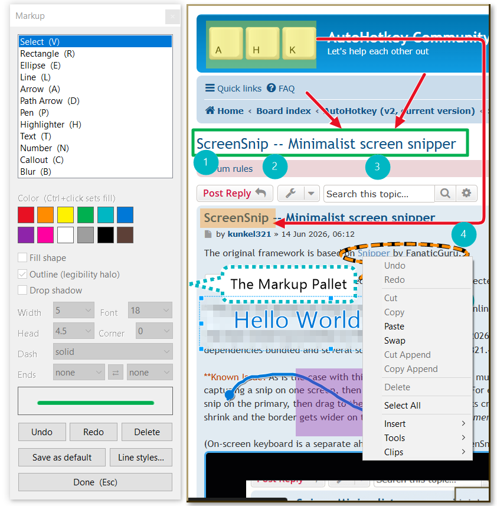

### The one big idea

**Nothing is ever painted into the image.** Annotations are kept as a list of objects on the snip and redrawn from scratch on every render, in the same coordinate space the crop uses. Three things follow from that, and they're the reason the feature is worth using:

- Every object stays selectable and editable forever. Recolour an arrow you drew twenty minutes ago; drag its point somewhere else; change its head from a triangle to a chevron.
- Pan, resize-region, rotate, flip and straighten all just work. Annotations track the pixels they were drawn on rather than the window they happen to be in.
- Annotations survive leaving markup mode. Press Esc, use the snip normally, then `Ctrl`+click any annotation to drop straight back in with that object selected.

The one fixed rule is z-order between *kinds*: blur and pixelate are a pixel operation on the image and are composited before everything else, so **redaction is always underneath every other annotation**. Within the overlay, objects stack in the order you drew them, and Bring to Front / Send to Back reorder them.

### Getting in and out

| Way in | |
|---|---|
| `M` on a focused snip | Start markup |
| Right-click → **Markup → Annotate…** | Same |
| `F3` | Start markup and show the pallet, or toggle the pallet if already in |
| `Ctrl` + click an existing annotation | Start markup with that object selected |
| `Ctrl` + click the snip's frame | Start markup with the frame selected |

`Esc` is deliberately staged, so it's a panic key that never destroys work. Each press does the next thing on this list:

1. Clear the selection.
2. Give back a borrowed tool (see below).
3. Return to the Select tool.
4. Leave markup mode.
5. *Then* — with markup off — close the snip, as Esc always does.

`M` again also leaves markup mode, as does the pallet's **Done** button and closing the pallet window.

### The tool pallet

A separate always-on-top window rather than a toolbar bolted onto the snip — a snip's whole identity is "a picture floating there with no chrome", and putting controls inside it would fight the border, bevel and shadow code. The pallet serves whichever snip is being annotated, and it parks itself beside that snip, `PalletGap` pixels clear, on whichever side has room. Drag it somewhere else and it will remember that spot *for that snip*.

It's created with `WS_EX_NOACTIVATE`, which is the detail that makes it feel right: clicking a pallet control does **not** take focus off the snip, so the single-letter tool keys keep working the whole time.

Set `PalletAutoShow` to `0` if you know the letters and would rather not have a second window on screen; `F3` still summons it.

| Pallet control | What it does |
|---|---|
| Tool list | The twelve tools, each with its key in brackets |
| Colour swatches | Twelve colours. Click sets the stroke colour; `Ctrl`+click sets the *fill* colour |
| Fill shape | Fill rectangles, ellipses and callouts with the fill colour |
| Outline (legibility halo) | A thin contrasting halo drawn under the object — on by default |
| Drop shadow | A hard offset shadow behind the object — off by default |
| Width | Stroke width. Loaded with the frame's own wider ladder when the frame is selected |
| Font | Point size for Text and the numeral inside a Number badge |
| Head / Disc | Arrowhead length as a multiple of stroke width — or, on a Number badge, the disc diameter in pixels (`auto` sizes it from the digits) |
| Corner | Corner radius for Rectangle, Highlighter and Callout, and the elbow radius on a Path Arrow. `auto` keeps the look each type had before the setting existed |
| Dash | Named dash pattern |
| Ends | Start cap, a swap button, end cap |
| Preview strip | A live sample drawn by the *same* routine the snip uses, so it can't lie to you |
| Undo / Redo / Delete | The obvious three |
| Save as default | Writes the current style back to the INI as the new defaults |
| Line styles… | Opens the arrowhead and dash editor — [section 11](#11-line-styles-arrowheads-and-dashes) |
| Done (Esc) | Leave markup mode |

### One control set, two jobs

This is the thing to internalise, because it's what keeps the feature free of a properties dialog:

- **With something selected**, changing a control edits the selection. With a group selected, it edits the whole group.
- **With nothing selected**, changing a control sets what the *next* object of that tool will look like.

The line-style properties are remembered **per tool**, not globally. Picking a chevron end while the Line tool is in hand doesn't quietly change what Arrow draws. The Highlighter likewise remembers its own colour separately from the stroke colour, so choosing cyan to highlight a paragraph won't repaint your next arrow.

Controls that don't apply to the current tool or selection are **greyed out** rather than hidden — the pallet's layout stays put, so nothing jumps around as you switch tools. Blur has no stroke, so Width and Dash grey; a Number badge has no arrowhead, so the Head box relabels itself **Disc** and takes a pixel diameter instead.

### The tools

| Tool | Key | Gesture | Notes |
|---|---|---|---|
| Select | `V` | Click / drag | Move, resize, restyle |
| Rectangle | `R` | Drag | Optional fill; `Corner` rounds it |
| Ellipse | `E` | Drag | Optional fill |
| Line | `L` | Drag | Both ends stylable |
| Arrow | `A` | Drag | A Line with an arrowhead on the end, by default |
| Path Arrow | `D` | Drag | Right-angled multi-segment arrow — `D` for dogleg, since `P` is Pen |
| Pen | `P` | Drag | Freehand |
| Highlighter | `H` | Drag | Translucent band, its own remembered colour |
| Text | `T` | Click | Opens a text box; `Ctrl+Enter` accepts |
| Number | `N` | Click | Auto-incrementing badge, 1, 2, 3… per snip |
| Callout | `C` | Drag | Speech bubble with a draggable tail |
| Blur | `B` | Drag | Redaction — see below |

A click with no drag is discarded rather than leaving an invisible zero-size object behind, so click-empty-space-to-deselect still works exactly as you'd expect.

**Path Arrow** records corners as you drag: move across the current segment far enough (`PathTurnTolerance`) and an elbow is committed, so you draw an L or an S in one gesture instead of assembling segments. Elbows are rounded by `Corner`, interior segments get slide handles for nudging a run over, and `PathMaxSegments` caps how baroque it can get.

**Callout** puts a tail on the bubble pointing back at where the drag began. Drag the tip handle to aim it anywhere; the two handles at its base widen or narrow it. The bubble's border has a gap where the tail joins, because a tail crossing a border reads as a mistake.

**Text and Number** are the two objects that stay upright when the snip is flipped or rotated. Press `F2` to re-edit a selected label, or `Ctrl`+click it — a text-bearing object opens its editor when you reach into it that way.

### Redaction: blur and pixelate

Drag with the Blur tool over anything you don't want to publish. `Pixelate` is on by default and is the more honest of the two — a blur can sometimes be reversed, blocky pixelation of a screenshot much less so. `BlurAmount` is the block size in pixels for pixelate, or the downscale factor for blur.

Because redaction is composited into the *image* stage rather than the overlay, it is glued to the pixels it hides. Pan the region and it stays over the right thing. It's also there in everything that leaves the snip: the clipboard, the saved file, an Imgur upload, and every OCR path. **The OCR engines see the redacted image, not the original** — which is what you want, but does mean you shouldn't blur something and then wonder why Copy Text skipped it.

Blur rectangles are deliberately never rounded. Rounded corners on a redaction box leave a sliver of the original showing.

### Selecting, moving, restyling

| Gesture | Effect |
|---|---|
| Click an object | Select it |
| `Shift` + click | Add / remove one object from the selection |
| `Shift` + drag on empty canvas | Marquee — sweep up everything inside |
| `Ctrl+A` | Select everything |
| Drag any selected object | Move the whole selection |
| Drag a handle | Resize (a group gets the eight box handles only) |
| Arrow keys | Nudge the selection 1 px — hold for key repeat |
| `Ctrl` + wheel | Step the size: stroke width, or point size on Text and Number |
| `Ctrl+D` | Duplicate |
| `Ctrl+PgUp` / `Ctrl+PgDn` | Bring to front / send to back |
| `Delete` | Delete the selection |
| `[` `]` and `\` | Cycle the start cap, end cap and dash (`Shift` reverses) |
| `Ctrl+\` | Swap the two ends |

A **plain** drag on empty canvas still moves the window, and a plain drag on the frame does too — that's why the marquee took `Shift` and why `Ctrl` is the "reach into the objects" modifier. `Ctrl` tells one story throughout: `Ctrl`+click selects an object, `Ctrl`+wheel resizes what you selected, `Ctrl`+click a swatch sets fill rather than stroke.

**The borrowed tool.** `Ctrl`+clicking an object while a drawing tool is in hand lends you the Select tool rather than switching to it. Fix the thing you reached for, then click on bare image and your drawing tool comes back. The tool list highlights the tool you'll *get back*, not the Select you're temporarily using. Set `StickyTool` to `0` if you'd rather it be a one-way trip.

### The snip's frame is selectable too

`Ctrl`+click the snip's border and it highlights as if it were an object: the colour swatches and the Width box now edit the frame. A short tooltip says so, since it's otherwise an invisible mode.

The frame gets its own width ladder running to 40 px, because 16 is generous for a pen stroke and stingy for a picture frame. The 3D bevel switches itself off above `Bevel3DMaxThickness`, and a rotated snip has no frame to hit, since the border is suppressed at non-cardinal angles anyway.

The frame and the objects are mutually exclusive — selecting an object drops the frame automatically.

### Undo

`Ctrl+Z` / `Ctrl+Y` (or `Ctrl+Shift+Z`), up to `UndoDepth` steps, per snip. Undo works on whole-list snapshots rather than command objects: the objects are small plain records, so a deep copy is cheap, and a snapshot stack can't get out of step with the model the way a hand-written undo/redo pair can.

**Clear All Markup** on the Markup submenu removes everything at once, and is itself undoable.

### Images

**Paste Image** (`Ctrl+V`) drops whatever bitmap is on the clipboard onto the snip as a movable, resizable object. **Add Image From File…** does the same from a PNG, JPG, BMP or GIF on disk. Handy for stamping a logo, an icon, or a second snip onto the one you're annotating.

### What ends up in the exported image

Everything except the editing chrome. Selection handles, the marquee, and the frame highlight are drawn into the *display* bitmap only — the clipboard, Save Image As, Imgur and every OCR path go through a separate build that leaves them out. You never have to deselect before copying.

---

## 11. Line styles: arrowheads and dashes

Any line-ish object — Line, Arrow, Path Arrow, Pen — carries three style properties: a **dash pattern**, a **start cap** and an **end cap**. Both ends of anything can be anything, so a line with a dot at one end and a chevron at the other is a normal thing to ask for rather than a special case.

Built in, ready to use:

| Arrowheads | `none` · `arrow` · `stealth` · `hollow` · `chevron` · `bar` · `dot` · `circle` · `square` · `diamond` |
|---|---|
| **Dashes** | `solid` · `dash` · `dot` · `dashdot` · `dashdotdot` |

Pick them from the pallet's **Dash** and **Ends** boxes, or cycle them from the keyboard with `[`, `]` and `\`.

### Adding your own

**Menu → Markup → Line Styles…**, or the **Line styles…** button on the pallet, opens a two-tab editor — Arrowheads and Dashes — with a list on the left, the definition on the right, and a live preview underneath. **New**, **Copy**, **Save** and **Delete** do what they say; **Reload from INI** re-reads the file if you've been editing it by hand in another window.

**No restart is needed.** This is the one part of the settings system that is genuinely live: custom styles are parsed a section at a time on demand rather than going through the load-time settings cache, precisely so the editor can work while you watch.

Definitions live in two INI sections of their own, and anything the editor writes is something you could equally have typed by hand:

```ini
[MarkupCaps]
; Name = poly|circle, fill|open|line, shrink, coordinates…
Fletch=poly, line, 0, 0,-0.55, 0.55,0, 0,0.55, 0.55,0, 1.3,0, 0.75,0.55
Ring=circle, open, 0.76, 0.38, 0.38

[MarkupDashes]
; Name = on, off, on, off …  (multiples of the stroke width)
Railroad=5, 2, 1, 2
Sparse=1, 4
```

**An arrowhead is data, not code.** Each one is a polygon (or a circle) in a normalised frame: the tip sits at `0,0`, `+x` runs back along the shaft, and the units are head-lengths. That's why "add your own arrowhead" is a parser and a dialog rather than a new branch in the renderer — the built-in triangle and something you typed go through the identical draw routine.

| Field | Meaning |
|---|---|
| `poly` / `circle` | A polygon from x,y pairs, or a circle from a centre distance and a radius |
| `fill` | Solid shape |
| `open` | Stroked outline, closed |
| `line` | Stroked polyline, *not* closed — this is what makes a chevron a chevron rather than a triangle |
| `shrink` | How far back the shaft stops, so no nub pokes through the cap |

A dash pattern is lengths alternating on, off, on, off — each a multiple of the stroke width, so a pattern keeps its proportions at any line weight. Every number must be greater than zero.

Two conveniences worth knowing:

**A custom entry may reuse a built-in name,** in which case it replaces the built-in in place rather than sitting next to it under the same label. Delete the override and the built-in comes back on the next reload — which is why Delete is offered even for built-in names.

**A malformed line is skipped, never fatal.** A typo in `[MarkupCaps]` means that one entry doesn't appear in the list; it never stops ScreenSnip from drawing. An object referring to a style you've since deleted falls back to `none` / `solid` rather than throwing.

### Save as default

The pallet's **Save as default** button writes the current styling back to `Data\snipSettings.ini` — colour, fill colour, thickness, font size, the three checkboxes, arrowhead scale, highlighter colour, badge diameter, and the per-tool dash and cap choices. It's a button rather than an automatic write because you don't want every experimental colour click rewriting your config.

One thing it saves is not in `[Markup]` at all: if a snip is being annotated, its **frame colour and width** are written to `[SnipWindow]`, where ScreenSnip and SettingsManager already look for them. The live values update too, so the next snip you capture wears the new frame without a restart. Snips already open keep the frame they have.

---

## 12. Exporting

### Clipboard

`Ctrl+C`, or menu → Copy to Clipboard. Copies exactly what you see — current crop, rotation, straighten, flips and annotations all applied, minus the editing chrome.

### Save to file

`Ctrl+S`, or menu → Save Image As…

- Formats: **PNG**, **JPG/JPEG**, **BMP**. Type no extension and you get PNG.
- Default filename is `ScreenSnip_yyyyMMdd_HHmmss.png`.
- Defaults to your Pictures folder the first time, then remembers the last folder you used for the rest of the session. Point it at `SavedImages\` once and it will stay there.
- **PNG saves with real transparency.** JPG and BMP can't carry an alpha channel, so a rotated snip's corners come out filled rather than transparent. If you've rotated something and want clean corners, save as PNG.

Everything goes through the same rendering pipeline (`BuildSaveBitmap`), so saving, clipboard, Imgur upload, and every OCR path all operate on identical pixels.

---

## 13. Text extraction: the local engines

The right-click menu's **OCR** submenu is assembled from whichever text-extraction modules are installed. With both present you get six items, split by a separator.

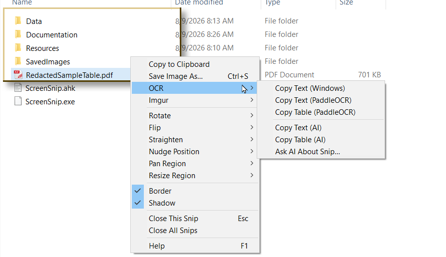

That separator is not decoration. **Below it, the image leaves your computer.** This section covers the three items above the line; [section 14](#14-text-extraction-the-ai-engine) covers the three below.

All six copy their result to the clipboard and report with a brief tooltip. Those tooltips carry real information — a row and column count, a warning about shaky cells — so it's worth making them legible; see [tooltip appearance](#3-settings).

### The three local actions

| Action | Engine | Best for |
|---|---|---|
| Copy Text (Windows) | Windows.Media.Ocr | Quick grabs. Instant, no setup beyond one library file |
| Copy Text (PaddleOCR) | PaddleOCR-json | Harder material — small text, low contrast, unusual fonts |
| Copy Table (PaddleOCR) | PaddleOCR-json | Grids. Reconstructs rows and columns, outputs TSV for Excel |

### Choosing between all three engines

Since the AI path overlaps with these, here is the whole picture in one place:

| | Windows OCR | PaddleOCR | AI vision |
|---|---|---|---|
| Speed | Instant | A second or two | Several seconds |
| Cost | Free | Free | Fractions of a cent per snip |
| Runs offline | Yes | Yes | **No** |
| Reproduces text verbatim | Yes | Yes | Usually — but may silently tidy |
| Understands tables | No | By clustering text boxes | By reading the ruling lines |
| Handles odd layouts | Poorly | Moderately | Well |

The short version: reach for Windows OCR by default, PaddleOCR when it struggles, and the AI when the *layout* is the hard part rather than the characters.

### Setting up Windows OCR

Download `OCR.ahk` from **https://github.com/Descolada/OCR** and drop it in `Resources\`, beside `SnipOCR.ahk`. It is included by that file with a plain `#Include OCR.ahk` — no path needed, and no `*i` flag, which means the file must be there. See [section 19](#19-things-that-will-bite-you) if you'd rather not have it.

If the library is present but Windows OCR itself is unavailable, the menu item reports as much and everything else keeps working.

### Setting up PaddleOCR

1. Download **PaddleOCR-json** (Windows x64) from https://github.com/hiroi-sora/PaddleOCR-json/releases/latest
2. Unzip it into `Resources\`. You want the folder containing `PaddleOCR-json.exe` **and** its `models` subfolder — these must stay together, because the engine is launched with that folder as its working directory and that's how the language config resolves.
3. If you put it elsewhere, point `OcrPaddleExe` at the `.exe`. The default expects `Resources\PaddleOCR-json\PaddleOCR-json.exe`.
4. Leave `OcrLangConfig` at `models\config_en.txt` for English. **The engine defaults to Simplified Chinese if this is blank.** Other configs shipped in the release: `config_chinese_cht.txt`, `config_japan.txt`, `config_korean.txt`.

Requires a CPU with AVX — any modern Core or Ryzen. If yours lacks it, RapidOCR-json is a drop-in substitute with the same JSON output.

### How table reconstruction works

PaddleOCR doesn't return a table. It returns loose text blocks with bounding boxes. ScreenSnip rebuilds the grid by clustering those boxes: blocks whose vertical centres are close become a row, blocks whose left edges are close become a column.

Both tolerances are expressed as a fraction of the **median text-block height**, so they scale automatically with font size and with the upscale factor — you shouldn't need to retune them when you switch between a small screenshot and a large one.

| Setting | Default | Raise it if... | Lower it if... |
|---|---|---|---|
| `RowTol` | 0.60 | One visual row is splitting in two | Two rows are merging |
| `ColTol` | 1.20 | One column is splitting | Two columns are merging |

This clustering approach has one structural limitation worth knowing, because it's the reason the AI table path exists: the engine only ever sees rectangles of *text*, never the drawn borders. A token that happens to land at the same x-coordinate in every row therefore reads as a column, even when it's purely an artifact of line wrapping inside one wide cell.

### Wrapped cells and reflow

A cell whose text wraps onto three lines arrives as three separate blocks, so a 5-row table can come out as 31 rows. Reflow stitches them back together.

The decision is made by measuring the **whitespace between consecutive rows** — not centre-to-centre pitch, which is contaminated by text height. In a table with wrapped cells those gaps are strongly bimodal: small gaps are line spacing inside a cell, large gaps are actual row borders. Split them into two groups, and reflow only if the large group is clearly bigger than the small one (`ReflowRatio`, default 1.8). In a table with no wrapping the gaps are all the same size and nothing gets merged.

But gaps alone aren't enough, and a real document proved it: on a scanned service grid, an 85 px gap sat *inside* a cell because a faint dash was never detected, while a genuine row border was only 39 px. The geometry lied. So there's a second test — the **anchor column** (`ReflowAnchorCol`, default column 1), which holds a label on every logical row and is blank on continuation lines. A new logical row must satisfy **both**: a big gap above it *and* content in the anchor column. Set it to 0 to use gaps alone; it falls back to gaps automatically if the anchor column turns out to be too sparse.

### The "this isn't a table" guard

If more than `NotATableWarn` (default 60%) of the text sits in a single column, the snip is almost certainly prose or a form rather than a grid, and Copy Text will do a far better job. ScreenSnip offers to switch rather than silently producing a mangled TSV.

Measured on real documents: a numeric grid ran 7%, a rubric 27%, a scanned service matrix 40% — but a one-column form with bullets hit 77%. Set to 0 to disable the prompt.

### Confidence

`MinScore` defaults to **0 — keep everything** — and that default is deliberate.

The reasoning: a confidence filter would earn its keep if a junk block could *shift* your data, but it can't. Every block is snapped to a column anchor, so dropping one leaves a hole and moves nothing. Filtering therefore buys no safety and costs real cells. And a hole is worse than a typo — a misread value is visible and fixable, whereas a dropped one just looks like a legitimately empty cell. On a real 21×20 table, `MinScore` 0.5 silently discarded 41% of it.

Raise it only when you're OCRing prose and want to suppress noise.

Instead of dropping cells, Copy Table **counts** the shaky ones (confidence below 0.6) and tells you in the completion tooltip. The table's *shape* is reliable; individual readings may not be. Those are the cells to eyeball against the original.

`MarkBelow` will append `?` to low-confidence cells so you can find them with Ctrl+F in Excel — but note that makes those cells text rather than numbers, so leave it at 0 for tables you'll compute on.

### Upscaling

Screen text is typically 10–14 px tall, right at the edge of what OCR engines handle well. `OcrUpscale` (default 3) bicubically enlarges the image before OCR, which makes a large accuracy difference for almost no cost.

There's a trap here worth knowing about. Paddle downsizes any image whose long edge exceeds `limit_side_len`, which would silently undo the upscaling. A 3× upscale of a modest snip lands around 5000 px, so a fixed limit of 2880 would shrink it straight back to an effective 1.7×. `OcrLimitSideLen = 0` means **auto** — size the limit to the image so no downscaling ever happens. That's what you want. `OcrMaxSideLen` (6144) is the safety ceiling; if you're exceeding it, lower `OcrUpscale` rather than raising the ceiling.

Note that the AI path does *not* upscale, and shouldn't — see the next section.

### Debugging a bad table

Set `OcrDebug` to 1 and three timestamped files appear in the `Data\` folder:

| File | Contents |
|---|---|
| `SnipOCR_<stamp>_image.png` | Exactly what the engine was fed |
| `SnipOCR_<stamp>_raw.json` | Exactly what the engine returned |
| `SnipOCR_<stamp>_blocks.txt` | How ScreenSnip clustered it — **the useful one** |

The blocks dump is the one to read. When a table comes out wrong there are only two suspects — the engine misread the text, or the clustering misplaced it — and you cannot tell which from the TSV alone. The dump shows you the per-block coordinates, scores, column anchors, computed tolerances, and what reflow decided and why.

Files are stamped per run. They used to use fixed names, which meant each OCR clobbered the previous one's evidence — very easy to end up comparing a run against itself without noticing.

---

## 14. Text extraction: the AI engine

`SnipAI.ahk` adds three more items to the OCR submenu, below the separator:

| Action | What it does |
|---|---|
| Copy Text (AI) | Verbatim transcription, straight to the clipboard |
| Copy Table (AI) | The table as TSV, ready to paste into a spreadsheet |
| Ask AI About Snip… | A free-form question; the answer opens in a window |

**Read this part first.** Unlike the two local engines, this one sends the image **off your machine** to OpenAI, and it **costs money** — fractions of a cent per snip, but not zero. It's also slower: expect several seconds. In exchange it handles multi-column layouts, tables, handwriting, math, and low-resolution antialiased text far better than either local engine. While experimenting with complex tables, fourteen cents USD were spent doing seven snips, but most single snips sent to OpenAI cost less than one cent.

### Setup

1. Get an API key at https://platform.openai.com/account/api-keys. The service is not free and requires prepaid credit. **kunkel321 receives no compensation from your transactions with OpenAI.**
2. Put the key in `Data\ApiKeys.ini`:
   ```ini
   [OpenAI]
   ApiKey=sk-...
   ```
   No quotation marks. That's the same file `SnipImgur.ahk` keeps its Client ID in, under an `[Imgur]` section — one credentials file to gitignore, one to back up.
3. Restart ScreenSnip.

Until a key is present, the three menu items are still there and each one puts up a dialog telling you exactly this, with the full path to the ini file. Nothing fails silently.

**Prepaid OpenAI credits expire after one year.** Buy a dollar or two at a time and set a budget alert.

### The caveat that matters most

**A vision model reports what it believes the text says, not what the pixels say.**

It will silently normalize odd spacing, and it can "correct" a genuine typo in the source. The prompts push hard against this — the transcription prompt explicitly instructs it to reproduce misspellings *as misspellings* — but instruction cannot eliminate the tendency.

For anything where an exact character sequence matters — a license key, a hex string, a hash, a password, a serial number — **use the local engines.** They read pixels and have no opinion about what the text ought to say.

### Copy Table (AI), and why it exists

This is the feature that justifies the module.

A vision model can see the table's **ruling lines**. No box-based OCR engine can. PaddleOCR infers columns by clustering the x-coordinates of text boxes, so a token that lands at the same x in every row reads as a column even when it's only an artifact of line wrapping inside one wide cell. The borders settle the question, and the prompt tells the model in as many words that ruling lines *outrank* text alignment.

Two other ideas carry weight in that prompt:

**A declared column count.** The model states the column count up front, and every row it emits must match. This converts the dangerous silent failure — a dropped empty cell shifting an entire row leftward, producing a plausible and wrong table — into something ScreenSnip can detect and warn you about in the completion tooltip.

**Grounding with local OCR.** When `SnipOCR.ahk` is present and `AiGroundWithOcr` is on (the default), PaddleOCR runs first and its text is sent along with the image as a *spelling* reference. The framing is deliberately lopsided: it grants the OCR authority over characters and explicitly strips it of any authority over layout. What gets sent is Paddle's reading-order lines, **not** its reconstructed grid — sending the grid would hand the model the very column mistake this feature exists to correct.

Grounding costs one extra local engine run of a second or two, offline. It's silently skipped if `SnipOCR.ahk` is absent or the engine isn't installed. It is an enhancement, never a prerequisite.

### Ask AI About Snip…

Type a question, get an answer in a resizable window with a **Copy Answer** button. The question comes first and the image is captured second, so cancelling the prompt costs nothing.

Useful for the things transcription can't do: *what does this error message mean*, *summarize this chart*, *what's wrong with this regex*, *what units is this axis in*. The preamble asks for concise, concrete answers and for exact quotation of any text it's reporting from the image, rather than paraphrase.

### Image handling and cost

`AiMaxSide` is 2048. The API scales anything larger down before tiling it, so sending a bigger image is pure upload time with no accuracy gain. **Unlike the local OCR path, there is no reason to upscale** — the model is not helped by it.

`AiDetail` is `high`, which tiles the image and reads fine print. `low` sends a single coarse thumbnail for roughly a tenth the cost, which is fine for "what is this a picture of" and useless for OCR.

`AiModel` ships as `gpt-5.6`. Any vision-capable chat model works. If the configured one isn't enabled on your account you'll get a clear "model not found" back — the error body is shown verbatim, so it's a one-line fix. Cheaper "mini"-tier models are markedly worse at dense small text; it's worth paying for the full model here.

### Debugging

`AiDebug` set to 1 keeps the temp PNG and writes the raw request and response into `Data\`. The request dump does **not** contain your API key — that rides in a header, not the body — but it does contain the base64-encoded image, so it will be large.

---

## 15. Imgur uploads

Entirely optional. Delete `Resources\SnipImgur.ahk` and the feature vanishes cleanly — the `#Include` uses the `*i` flag and every menu is built behind an `IsSet(Imgur)` test.

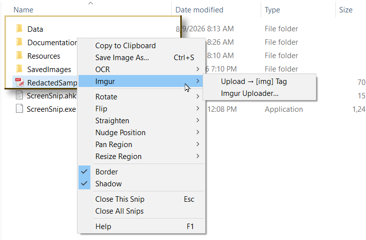

### One-time setup

You need a free Imgur account and a Client ID:

1. Create an account at https://imgur.com/register — any email address will do. There's no paid tier involved.
2. Signed in, go to **Settings → Applications** (https://imgur.com/account/settings/apps).
3. Add a new application. Name it anything.
4. Authorization type: **"Anonymous usage without user authorization"**.
5. Leave the callback URL blank and submit.
6. Copy the **Client ID**. Ignore the Client Secret — anonymous uploads never use it.
7. Paste it into ScreenSnip via the Uploader's **Client ID…** button.

It's stored in `Data\ApiKeys.ini` under an `[Imgur]` section — the same file `SnipAI.ahk` uses. **Add the `Data` folder to `.gitignore`.** A Client ID isn't a password, but it's rate-limited against your account and you don't want strangers spending your daily allowance.

### Two ways in

**Right-click a snip → Imgur → Upload → [img] Tag** is the one-click path. It renders the snip, uploads it, and puts a BBCode `[img]` tag on your clipboard ready to paste into a forum post.

**Imgur Uploader…** opens the full dialog. Reachable two ways:

- Right-click a snip → **Imgur → Imgur Uploader…** — opens with that snip pre-loaded
- **Tray menu → Imgur Uploader…** — opens empty, for files already on disk

The tray route is the one to use for an animated GIF or an old screenshot that ScreenSnip never captured. Drag a file onto the dialog, or use **Browse…**.

### The Uploader dialog

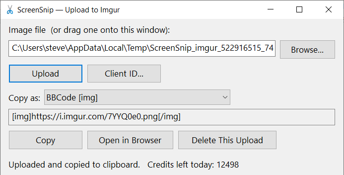

| Control | Purpose |
|---|---|
| Path box | The file to upload. Drag-and-drop onto the window works |
| Browse… | File picker |
| Upload | Sends it |
| Client ID… | Opens the setup dialog, with clickable links to Imgur |
| Copy as: | Link format — changing it re-copies immediately |
| Copy | Re-copy the current link |
| Open in Browser | Opens the Imgur *page* for the upload |
| Delete This Upload | Removes it from Imgur — read the warning below |

Link formats offered:

- **Direct link** — `https://i.imgur.com/ID.png`, the embeddable file
- **BBCode [img]** — the default, and what the one-click menu item always emits
- **BBCode thumbnail linked** — a 640 px thumbnail that links to the full image, so a big screenshot doesn't blow out a forum thread's layout
- **Markdown**
- **HTML**
- **Page link** — the imgur.com page rather than the image itself

ScreenSnip derives the direct link from the response's `id` and `type` fields rather than by editing the URL text. `type` is the MIME type of the image **as Imgur stored it**, which matters because Imgur re-encodes BMP and TIFF uploads to PNG. Guessing the extension from the source filename would produce a dead link in those cases.

### Deleting an upload — read this before relying on it

An **anonymous upload isn't owned by your account** and doesn't appear in it. The only handle on it is the "deletehash" that Imgur returns, and ScreenSnip deliberately keeps **no log file** — so the deletehash is remembered for the current session only.

**Once ScreenSnip exits, an anonymous upload is effectively permanent.**

Delete while you still can via *Imgur Uploader… → Delete This Upload*, which acts on the most recent upload of the session.

Because that's a lot of consequence for one menu click on a snip that might be showing an email or a password field, the one-click path asks for confirmation by default. Turn `ImgurConfirmBeforeUpload` off once the flow feels familiar.

### Size limit

**Treat 10 MB on disk as the ceiling**, and note this is the *API's* limit, not Imgur's.

Imgur's website accepts 20 MB for stills and 200 MB for animated files. The JSON API that ScreenSnip posts to caps out around 10 MB, and base64 encoding inflates the payload by roughly a third on top of whatever the file weighs.

Some tools get past this by posting `multipart/form-data` with raw bytes instead of a base64 form field. ScreenSnip deliberately doesn't — it would mean hand-rolling a MIME body and a SafeArray for a case that a smaller GIF solves just as well.

For an oversized GIF the practical fix is to shrink it: drop frames, reduce the dimensions, or run a lossy pass. `gifsicle -O3 --lossy=80` is startlingly effective.

### Animated GIFs

They work, with one caveat you should know about.

Imgur re-encodes any GIF over roughly **2 MB** to GIFV — an MP4 in a wrapper, audio stripped — and then reports the stored type back as `video/mp4`. A naive uploader builds the direct link from that type and produces `i.imgur.com/ID.mp4`, which renders as a **broken image** inside an `[img]` tag on every forum there is. This is why an animated upload can look like it failed when in fact it uploaded perfectly.

ScreenSnip detects the conversion and keeps a `.gif` URL as the primary link, since Imgur goes on serving the GIF alongside the video. The `.mp4` and `.gifv` URLs remain available from the "Copy as:" dropdown for anywhere that can play video.

One consequence: Imgur's thumbnails of an animated image are **still frames**, so "BBCode thumbnail linked" on a GIF gives a motionless preview that links through to the moving version. Usually the polite thing to post in a thread; occasionally not what you wanted.

### Rate limits

Roughly 1,250 uploads and 12,500 requests per day per Client ID. Remaining credits are shown in the Uploader's status line after each upload.

### What actually gets uploaded

Exactly what you see: the snip's current crop, flips, rotation, straighten and annotations, rendered through the same pipeline Save Image As uses. It's written to a temporary PNG in `%TEMP%`, uploaded, and deleted immediately. Orphaned temp files from a crash are swept on the next open of the dialog.

---

## 16. Games: the puzzle modules

Two independent modules put a **Games** submenu on any snip: `SnipPuzzle.ahk` supplies the grid puzzles (Slide and Swap) and `SnipJigsaw.ahk` supplies the jigsaw. Delete either and the other carries on; delete both and the Games item disappears.

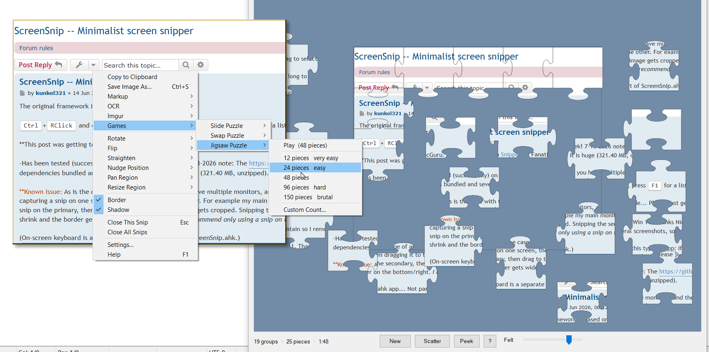

All three cut up **exactly what the snip currently shows** — crop, rotation, flips, annotations and all. Snip a photo, a spreadsheet, a friend's forum post, whatever. By default the snip stays open beside the game as your reference picture; set `CloseSnipOnStart` if you'd rather it become the puzzle.

None of them is the "evil" variant that holds a window hostage. Nothing is hidden, nothing is blocked, and Esc closes the game whenever you like — though if you're partway through, it asks first, and tells you how many moves or joined pieces you're about to throw away.

### Slide Puzzle

The classic 15-puzzle. One tile is removed and the rest are shuffled.

**Click any tile in the blank's row or column** and it slides into the gap — and so does everything between them, so a click three cells away moves three tiles at once.

| Key | |
|---|---|
| Click a tile | Slide it and its neighbours over |
| Arrow keys | Slide one tile that way into the gap |
| `Ctrl+Z` | Undo the last slide |
| `Space` (hold) | Peek at the finished picture |
| `N` | Numbers on the tiles, on / off |
| `R` | Shuffle and start over |
| Right-click | Menu — grid size, puzzle type, and the above |
| `F1` | Help |
| `Esc` | Close |

The shuffle is made of **real slides**, which is not laziness — it's the point. A randomly permuted 15-puzzle is solvable only half the time, and shuffling by legal moves sidesteps the parity problem entirely. Solve it and the seams dissolve, the numbers fade, and you get your time.

### Swap Puzzle

Same grid, no missing tile. Click a tile to pick it up, then click one of its four neighbours to trade places. Only neighbours — diagonals and distant tiles aren't a move, and clicking a far-away tile just moves the pick there instead. Arrow keys swap the picked tile in that direction.

Every other key is the same as the slide puzzle. Any arrangement of a swap board *is* solvable, so this one gets a straight random shuffle.

You can switch between Slide and Swap mid-game from the puzzle's right-click menu — it rebuilds around the same picture and grid, which is the polite way out of a slide puzzle you've made a mess of.

### Jigsaw Puzzle

A real jigsaw: interlocking shaped pieces, cut fresh every time, scattered across a felt table.

**Drag a piece anywhere.** Let go of it near where it belongs, next to a piece it joins onto, and the two snap together and move as one from then on.

| Key | |
|---|---|
| Drag | Move a piece, or a joined group |
| `Space` (hold) | Peek at the finished picture |
| `S` | Re-scatter the pieces still loose |
| `F` | The faint assembly frame, on / off |
| `R` | New puzzle, freshly cut |
| Right-click | Menu — piece count, and the above |
| `F1` | Help |
| `Esc` | Close |

Piece counts on the Games submenu run **12 (very easy) · 24 (easy) · 48 · 96 (hard) · 150 (brutal)**, plus **Custom Count…** for anything from 12 to 300. The exact number is rounded to fit the snip's shape, so a wide snip gets a wide grid. Every cut is generated fresh, so the same snip gives you a different puzzle each time.

The interlock is structural rather than approximate, which is the part that makes it feel like a real jigsaw. What gets generated is the **edges**, not the pieces: two tables of them, with straight borders and a random tab direction and jitter on every interior edge. A piece then looks its four edges up rather than inventing them — its bottom edge is literally the same table entry as the top edge of the piece below, walked backwards. A tab and its socket cannot disagree, because they are the same curve.

Four design decisions worth knowing:

**Pieces snap only to other pieces, never to the frame.** So you can assemble the picture anywhere on the table, the way you actually do with a real jigsaw. The faint assembly frame is a hint about where the finished picture would sit, nothing more, and `F` turns it off.

**The counter counts groups, not placed pieces.** `19 groups · 25 pieces · 1:48` means you have nineteen separate clusters left; at 1 you're done. A "pieces placed" number would sit still while you assembled clusters off to one side, which is most of what jigsaw play actually is.

**Loose pieces are dealt onto a jittered lattice**, not scattered purely at random. Pure random looks authentic for about ten seconds and then you're hunting for a piece buried under three others. `S` re-deals whatever is still loose when the table gets messy.

**Clicks land on the shape, not the bounding box.** Hit-testing reads each piece's alpha channel, so clicking in the notch beside a knob picks up the piece underneath rather than the one whose rectangle you happened to be inside. Snap tolerance follows the piece size — about a sixth of the shorter side — unless you pin it with `SnapPixels`.

The **Felt** slider on the toolbar is a lightness dial for the table, not a colour picker: `FeltColor` in the INI supplies the hue and the slider walks it from black up to a fully-lit version of that same colour. It's session-only and doesn't write back — if you find a shade you like, read it off and put it in the INI.

`CanvasScale` trades table space against picture size. The canvas is pinned to your screen either way, so a bigger scale means more room for loose pieces and a smaller picture. 180 is the shipped value; 140–150 is roomier for the picture and still has plenty of table, since the scatter lattice spreads pieces over the whole canvas anyway. The picture is never scaled *up* past 1:1 — enlarging a screenshot just makes a blurry puzzle — so a small snip plays at its own size with a proportionally larger table.

---

## 17. Menu reference

### Right-click menu (on a snip)

| Item | Notes |
|---|---|
| Copy to Clipboard | |
| Save Image As… | `Ctrl+S` |
| **Markup** → | Annotate… · Show/Hide Tool Pallet · Paste Image · Add Image From File… · Swap Line Ends · Line Styles… · Select All · Edit Text… · Duplicate · Bring to Front · Send to Back · Delete Selected · Undo · Redo · Clear All Markup *(if `SnipMarkup.ahk` is present)* |
| **OCR** → | Copy Text (Windows) · Copy Text (PaddleOCR) · Copy Table (PaddleOCR) *(if `SnipOCR.ahk` is present)* — separator — Copy Text (AI) · Copy Table (AI) · Ask AI About Snip… *(if `SnipAI.ahk` is present)* |
| **Imgur** → | Upload → [img] Tag · Imgur Uploader… *(if `SnipImgur.ahk` is present)* |
| **Games** → | Slide Puzzle · Swap Puzzle *(if `SnipPuzzle.ahk` is present)* · Jigsaw Puzzle *(if `SnipJigsaw.ahk` is present)* |
| **Rotate** → | 90° CW · 180° · 90° CCW |
| **Flip** → | Horizontal · Vertical |
| **Straighten** → | CW · CCW · Reset Straighten |
| **Nudge Position** → | Moves the window |
| **Pan Region** → | Moves the crop |
| **Resize Region** → | Resizes the crop |
| Border | Checkable toggle, per snip |
| Shadow | Checkable toggle, per snip |
| Close This Snip | `Esc` |
| Close All Snips | |
| Settings… | Opens SettingsManager *(only if it's in `Resources\`)* |
| Help | `F1` |

Markup sits up with the primary actions rather than down among Rotate and Flip, because it's a step in the capture → annotate → share workflow and belongs above the OCR and Imgur items that follow it.

The OCR submenu disappears entirely if neither text-extraction module is installed. Everything below the separator inside it sends your image to a paid online service.

The Markup submenu's editing items — Select All, Duplicate, z-order, Delete — act on whatever is currently selected. They live there rather than on a right-click-the-object menu of their own, because a snip's right-click already opens this menu, so there's no second gesture to learn.

Menu items that have a hotkey display it right-aligned as a reminder. The directional submenus use a 1 px step; hold Shift with the equivalent hotkey for 10 px. Greyed-out lines like "Hold Shift → ±10 px" are hints, not clickable items.

The menu acts on the snip you right-clicked, which is not necessarily the focused one — with two exceptions grouped at the bottom next to Help, because neither Settings… nor Help does anything to a snip at all.

### Tray menu

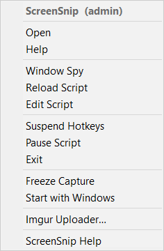

| Item | Notes |
|---|---|
| **ScreenSnip** *(or* **ScreenSnip (admin)** *)* | Disabled title. Shows elevation state at a glance |
| *(standard AHK items)* | Open, Help, Window Spy, Reload, Edit, Suspend, Pause, Exit |
| Freeze Capture | Same as the trigger key. A discoverable way in, and a fallback when another script has won the race for the key |
| Start with Windows | Checkable. Creates/removes a Startup folder shortcut |
| Imgur Uploader… | *(only if `SnipImgur.ahk` is present)* |
| Settings… | Opens SettingsManager *(only if it's in `Resources\`)* |
| ScreenSnip Help | |

The `(admin)` suffix on the title is worth glancing at whenever a capture mysteriously doesn't work — see [section 19](#19-things-that-will-bite-you).

---

## 18. Keyboard and mouse reference

Most snip hotkeys are context-sensitive: they only fire when a snip window is focused, so they don't interfere with anything else. The markup keys go one step further and require a markup session on the *active* snip, which is why a bare `R` can never escape onto anything else.

### Capturing

| Keys | Action |
|---|---|
| `Ctrl` + RButton drag | Capture a region |
| `Ctrl+Shift` + RButton drag | Capture and copy to clipboard |
| Double-tap `CapsLock` | Freeze the screen (configurable) |
| `Shift+PrintScreen` | Show / hide all snips |

### During a Freeze Capture

| Keys | Action |
|---|---|
| RButton drag | Select a region from the frozen image |
| Hold `Shift` on release | ...and copy to clipboard |
| LButton click | Capture the highlighted window whole |
| Wheel up / down | Cycle to a window stacked underneath |
| `Esc` | Cancel the freeze |

### On a snip

| Keys | Action |
|---|---|
| `F1` | Help |
| `Esc` | Close this snip |
| `Ctrl+C` | Copy image to clipboard |
| `Ctrl+S` | Save image as… |
| `M` | Start markup |
| `F3` | Show / hide the markup pallet |

### Move the window

| Keys | Action |
|---|---|
| `Ctrl+Arrow` | ± 1 px |
| `Ctrl+Shift+Arrow` | ± 10 px |
| Left-drag | Free |

### Adjust the capture region

| Keys | Action |
|---|---|
| `Ctrl+Alt+Arrow` | Pan ± 1 px |
| `Ctrl+Shift+Alt+Arrow` | Pan ± 10 px |
| Right-drag | Pan, continuous |
| `Win+Alt+Arrow` | Resize ± 1 px |
| `Win+Shift+Alt+Arrow` | Resize ± 10 px |
| Drag an edge/corner | Resize, continuous — opposite edge anchored |
| `Alt` + right-drag | Resize by cursor travel — top-left anchored |

### Rotate, straighten, flip

| Keys | Action |
|---|---|
| `Alt+Left` / `Alt+Right` | Rotate ± 1° |
| `Shift+Alt+Left` / `Right` | Snap to next 30° |
| `Alt+,` / `Alt+.` | Straighten ± 1° |
| `Shift+Alt+,` / `.` | Straighten ± 0.5° |
| `Shift+Left` / `Shift+Right` | Flip horizontal |
| `Shift+Up` / `Shift+Down` | Flip vertical |

### Transparency

| Keys | Action |
|---|---|
| `Alt+Up` / `Alt+Down` | ± 25 |
| `Alt+wheel` | ± 10 |

### In markup mode

Tool keys:

| Key | Tool | | Key | Tool |
|---|---|---|---|---|
| `V` | Select | | `H` | Highlighter |
| `R` | Rectangle | | `T` | Text |
| `E` | Ellipse | | `N` | Number |
| `L` | Line | | `C` | Callout |
| `A` | Arrow | | `B` | Blur |
| `D` | Path Arrow | | | |
| `P` | Pen | | | |

Everything else:

| Keys | Action |
|---|---|
| `M` | Leave markup mode |
| `Esc` | Deselect → return borrowed tool → Select tool → leave markup |
| `F2` | Edit the selected label's text |
| `F3` | Show / hide the pallet |
| `Ctrl+A` | Select all objects |
| `Shift` + click | Add / remove one object from the selection |
| `Shift` + drag | Marquee-select |
| `Ctrl` + click | Select an object (or the frame) without leaving your tool |
| `Ctrl` + wheel | Step the selection's stroke width or point size |
| Arrow keys | Nudge the selection 1 px |
| `Delete` | Delete the selection |
| `Ctrl+D` | Duplicate |
| `Ctrl+V` | Paste an image from the clipboard |
| `Ctrl+PgUp` / `Ctrl+PgDn` | Bring to front / send to back |
| `Ctrl+Z` / `Ctrl+Y` | Undo / redo (`Ctrl+Shift+Z` also redoes) |
| `[` / `Shift+[` | Cycle the start cap forward / back |
| `]` / `Shift+]` | Cycle the end cap forward / back |
| `\` / `Shift+\` | Cycle the dash pattern forward / back |
| `Ctrl+\` | Swap the two ends |
| `Ctrl+Enter` | Accept the text-entry dialog |

Two notes on what *isn't* here. `Shift+Arrow` is the core's Flip and stays that way, so markup nudging is plain arrows only — hold one down and key repeat covers the distance. And `Alt`+wheel is left alone for transparency, which is why the markup wheel gesture takes `Ctrl`.

---

## 19. Things that will bite you

### You can't snip an elevated window unless ScreenSnip is also elevated

This is the big one, and it isn't a bug — it's Windows UIPI (User Interface Privilege Isolation). A normal-integrity process can't hook input over a higher-integrity window. If you have XYplorer, VSCode, or anything else running as admin, ScreenSnip at normal integrity can't capture over it.

Symptoms are confusing: dragging a selection *onto* such a window can leave the rectangle stuck on screen, because the button-release event never reaches ScreenSnip's hook. Press **Esc** to clear a stuck rectangle — that's the safety valve.

**Check the tray menu title.** It reads `ScreenSnip (admin)` when elevated. `A_IsAdmin` is fixed at launch, so this is reliable.

**The fix is Task Scheduler, not the Startup folder.** An elevation-requesting program in the Startup folder is silently blocked at logon — Windows won't auto-approve a UAC prompt. Create a task with "Run with highest privileges", triggered at logon, and set **Start in** to the script's folder. Also uncheck "Start the task only if the computer is on AC power" on the Conditions tab if you're on a laptop; it's ticked by default and is a classic silent-failure trap.

**A confusing corollary:** launching `ScreenSnip.exe` from within an already-elevated file manager makes it inherit the parent's admin token. So it works that session and mysteriously stops the next time you launch it normally. If elevation seems intermittent, this is usually why.

The same wall shows up during a Freeze Capture window grab: if you release the left button over an elevated window while ScreenSnip isn't elevated, Windows hides that event and the button state reads "down" indefinitely. The wait is bounded at three seconds and checks Esc throughout, so the worst case is a short pause rather than a stranded full-screen backdrop.

### Drag-and-drop into the Imgur Uploader when elevated

Same UIPI wall, opposite direction. Explorer runs at medium integrity; an elevated ScreenSnip runs at high; messages from the former to the latter are silently discarded. Dragging a file from your Desktop onto the Uploader used to do nothing at all — no error, no beep, no cursor change.

This is handled now. `ImgurAllowDropsWhenElevated()` uses `ChangeWindowMessageFilterEx` to whitelist the three drop-related messages (`WM_DROPFILES`, `WM_COPYDATA`, and the undocumented `WM_COPYGLOBALDATA`) on the Uploader's window alone. Per-window scope, three messages — nothing else about the process's isolation changes.

### Deleting `OCR.ahk` while keeping `SnipOCR.ahk`

The add-on modules are all included with `*i` and can all be deleted freely. **Descolada's `OCR.ahk` is different.** `SnipOCR.ahk` pulls it in with a plain `#Include OCR.ahk` — no `*i` — so if `SnipOCR.ahk` is present and `OCR.ahk` isn't, ScreenSnip won't start.

Two ways out: delete `Resources\SnipOCR.ahk` too (you lose the PaddleOCR items as well), or keep it and comment out its `#Include OCR.ahk` line near the top, which leaves the PaddleOCR items working and drops only the Windows OCR one.

### The AI silently tidies your text

Covered in [section 14](#14-text-extraction-the-ai-engine), and repeated here because it's the kind of thing you discover at the worst moment. A vision model transcribes what it believes the text *says*. It will normalize odd spacing and can quietly fix a typo that was really there. For a license key, a hash, or anything where the exact characters matter, use Copy Text (Windows) or Copy Text (PaddleOCR).

### Redaction is permanent in the file, not in the snip

A blur or pixelate rectangle is a *object*, not a destructive edit. Everything that leaves the snip — the clipboard, a saved PNG, an Imgur upload, every OCR path — is genuinely redacted, and the hidden characters are not recoverable from those. But in the live snip the original pixels are still in the frozen master until you close it, so undo or deleting the blur object brings them straight back. Fine for publishing a screenshot; not a reason to leave a redacted snip up during a screen share.

### While annotating, an edge drag moves the snip instead of resizing it

Deliberate, and it takes ten seconds to get used to. During a markup session the image is drawing canvas, so the frame becomes the snip's drag-to-move handle — which, with a fat border, is the best handle an annotated snip has. Resizing from an edge wants `Alt` while a session is open, and the resize cursor stays hidden so it never promises something the drag won't do. Leave markup mode and bare edge-drag resizing comes back.

### Blur always sits under everything else

Redaction is composited into the image before the annotations are drawn on top, so you cannot put an arrow *under* a blur. That's a consequence of blur being a pixel operation and everything else being vector overlay, and it happens to be the order you want anyway.

### Snips never scale

A snip is always 1:1 with the pixels that were captured. "Resize" always means re-cropping the frozen master, which is why growing stops dead at `CaptureAdjustMargin` and why a snip can't be stretched to twice its size. If another tool resizes a snip window from the outside, ScreenSnip re-crops to match rather than stretching — but it can only give you pixels the master actually has.

### Freeze Capture can't capture ScreenSnip's own menus

While one of ScreenSnip's own menus is open, the script's thread is inside that menu's modal loop, so the freeze trigger has nothing to run on. The tray menu's own **Freeze Capture** item is fine — selecting it closes the menu *before* the callback runs — but you can't freeze a ScreenSnip context menu in the act of being open. Use another capture tool for that particular screenshot.

### Running `SnipWinDetect.ahk` standalone alongside ScreenSnip

The module has a self-test you can run by executing it on its own: F1 starts detection, the wheel cycles, a click reports the rect it would have captured, Esc stops, F12 exits.

What you can't do is run that self-test *and* trigger a Freeze Capture from a separately running ScreenSnip. Windows belonging to its own process are filtered out of the snapshot, and when the two run as separate processes, ScreenSnip's frozen backdrop isn't "this process" — so it's treated as an ordinary window, and being topmost and screen-sized, it's the only thing the cursor can ever be over. You get one big rectangle around the whole screen. Once the file is `#Include`d into ScreenSnip they share a process, the backdrop is filtered out automatically, and the real windows underneath become visible to the hit test.

### The magenta halo on rotated snips

At angles other than 0/90/180/270, a fringe of magenta pixels can appear around the edge of a snip. This is the transparency color key bleeding through at the anti-aliased boundary.

It's a display artifact only. **Saved PNGs and Imgur uploads are unaffected** — they go through a separate path that produces genuinely transparent corners rather than the color key. Known issue; cosmetic.

### Borders disappear when you rotate

Deliberate. A rectangular border doesn't map onto a tilted snip, so it's suppressed at non-cardinal angles. Same rule applies to the drop shadow and to edge-drag resizing — and, since there's no frame to click, to selecting the frame in markup mode.

### Two scripts can't share a hotkey

Each AHK script installs its own keyboard hook. Whichever hook sits earlier in the chain and *suppresses* a key wins, and the other script never sees it. If your Freeze Capture trigger does nothing, something else probably owns it.

Don't fight it — use the [cross-script message trigger](#the-cross-script-trigger) and let the script that already owns the key broadcast to ScreenSnip.

### Straighten runs out of room

Tilting the image pulls in pixels from outside the current crop, and those come from the `CaptureAdjustMargin` snapshot. Past a certain angle you run out and the corners go empty. Increase the margin if you deskew a lot.

### Copy Table on something that isn't a table

You'll get a prompt offering plain text instead. Take it. Forms and prose put nearly all their text in one column, and the grid reconstruction has nothing sensible to do with that.

### JPG and BMP lose transparency

Only PNG carries an alpha channel. Rotate a snip and save it as JPG and the corners come out filled, not transparent.

### A setting you changed did nothing

Settings are read once, at launch. Nothing re-reads the file, so a change needs a restart before it means anything. SettingsManager offers one after you save — take it. Restarting closes any snips you have open, so finish with them first.

The exceptions are the two custom-style sections, `[MarkupCaps]` and `[MarkupDashes]`, which the Line Styles editor re-reads on demand.

If a restart doesn't help either, check the value's *form*: a number where text belongs, a color with a `#` or `0x` in front, or six characters that aren't all hex digits will each be rejected in favour of the built-in default rather than applied. That's deliberate — a nonsense `TransColor` would punch holes in every snip — but it does mean an invalid value fails quietly.

### Editing snipSettings.ini while something else has it open

SettingsManager writes the whole file when you save, so a hand edit made in a text editor in the meantime is overwritten. Pick one or the other for a given sitting.

Markup adds a second writer to keep in mind: the Line Styles editor and the pallet's **Save as default** button both write into the same INI. They write single keys rather than the whole file, so they're much less destructive than a full SettingsManager save — but a SettingsManager save that started before those writes will still stomp them. Finish one, then start the other.

Relatedly, launching SettingsManager from the menu when it's already running just raises the existing window rather than starting a second copy. It's `#SingleInstance Force`, so a second launch would kill the first and take any unsaved edits with it.

### Puzzle sounds ignore your volume mixer

Both puzzle modules use `SoundBeep` for the snap click and the completion fanfare, which goes through the system speaker path rather than the app mixer. Turn `SoundOnSnap` / `SoundOnSolve` off if that's intrusive.

### Something threw and you want to know what

Unhandled errors are appended to `Data\ScreenSnip_error.log` with a timestamp. If the `Data` folder can't be created, that falls back to the script folder.

---

## 20. Settings reference

A map of `Data\snipSettings.ini`, section by section, in file order. Values shown are as shipped.

This is a reference, not a tutorial. The full explanation of any given setting lives in `Data\snipSettingsMetadata.json` and is shown in SettingsManager's help pane while you edit it — see [section 3](#3-settings).

Two things apply throughout: every key falls back to a coded default if it's missing, blank, or invalid, and nothing is re-read after launch (bar the two custom-style sections at the end).

### `[Capture]`

| Key | Shipped | Purpose |
|---|---|---|
| `SelectionColor` | `B58500` | Selection overlay color while dragging |
| `SelectionOverlayAlpha` | `80` | Opacity of that overlay, 0–255 |
| `CaptureAdjustMargin` | `250` | Snapshot headroom in px, per side |

### `[DimensionLabels]`

| Key | Shipped | Purpose |
|---|---|---|
| `ShowDimensionLabels` | `1` | Master switch for the W×H labels |
| `InfoFontSize` | `10` | Label font size |
| `InfoWHOffsetRight` / `InfoWHOffsetBottom` | `38` / `25` | Label inset from the edges |
| `InfoWMinWidth` / `InfoHMinHeight` | `75` / `55` | Minimum selection size before each label shows |

### `[FreezeCapture]`

| Key | Shipped | Purpose |
|---|---|---|
| `FreezeCaptureKey` | `CapsLock` | Trigger key. Blank disables the built-in trigger; the cross-script message trigger still works |
| `FreezeDoublePress` | `1` | Require a double press |
| `FreezeDoublePressTime` | `400` | Max ms between the two presses |
| `FreezeNullifyCapsLock` | `1` | Force CapsLock off after every press. Ignored unless the trigger key *is* CapsLock |

### `[FreezeHint]`

| Key | Shipped | Purpose |
|---|---|---|
| `ShowFreezeHint` | `1` | Show the hint pill over the frozen backdrop |
| `FreezeHintText` | *(see file)* | Wording when window detection is off. `` `n `` for line breaks |
| `FreezeHintTextWinDetect` | *(see file)* | Wording when `SnipWinDetect.ahk` is loaded and enabled |
| `FreezeHintFontName` / `FreezeHintFontSize` | `Segoe UI` / `15` | |
| `FreezeHintTextColor` / `FreezeHintBackColor` | `FFFFFF` / `1E1E1E` | Hex RRGGBB |
| `FreezeHintAlpha` | `185` | Pill opacity, 0–255 |
| `FreezeHintCornerRadius` | `70` | Corner rounding in px. `0` = square |

The two hint strings are separate on purpose: deleting `SnipWinDetect.ahk` has to leave the hint truthful rather than advertising a click that does nothing.

### `[SnipWindow]`

| Key | Shipped | Purpose |
|---|---|---|
| `ShowSnipBorder` | `1` | |
| `BorderColor` | `B58500` | Falls back to `SelectionColor` if absent, so the selection tint and the finished snip match by default |
| `BorderThickness` | `2` | px |
| `Bevel3D` | `1` | The 3D floating look |
| `Bevel3DMaxThickness` | `3` | Bevel auto-disables above this |
| `Bevel3DStrength` / `Bevel3DInactiveStrength` | `0.55` / `0.55` | Blend toward white/black, 0–1 |
| `Bevel3DInactiveDarknessFactor` | `0.2` | How much both edges dim when unfocused |
| `TransColor` | `FF00FF` | Magenta color key for rotated corners |

`BorderColor` and `BorderThickness` are the two keys the markup pallet's **Save as default** button will rewrite for you, if a snip is being annotated when you press it.

### `[SnipShadow]`

| Key | Shipped | Purpose |
|---|---|---|
| `ShowSnipShadow` | `1` | Default for new snips |
| `ShadowColor` | `000000` | |
| `ShadowOffset` / `ShadowOffsetInactive` | `5` / `3` | Down/right offset, logical px |
| `ShadowBlur` | `4` | Edge softness. Keep ≤ `ShadowOffset` for a drop rather than a halo |
| `ShadowAlpha` | `105` | Peak opacity, 0–255 |

### `[Gestures]`

| Key | Shipped | Purpose |
|---|---|---|
| `PanDragDivisor` | `3` | Mouse px per 1 px of pan on a right-drag. `1` = 1:1 |
| `PanClickSlop` | `5` | Drag distance below which it's a plain right-click |
| `EdgeGrabZone` | `6` | Grabbable band inward from each edge |
| `ResizeDragDivisor` | `3` | Mouse px per 1 px of resize on an `Alt`+right-drag. `1` = 1:1 |

### `[Straighten]`

| Key | Shipped | Purpose |
|---|---|---|
| `StraightenStep` | `1` | Degrees per `Alt+,` / `Alt+.` |
| `StraightenFineStep` | `0.5` | Degrees per `Shift+Alt+,` / `.` |
| `StraightenMaxAngle` | `15` | Hard clamp |

### `[Saving]`

| Key | Shipped | Purpose |
|---|---|---|
| `SaveDefaultFolder` | `%USERPROFILE%\Pictures` | The *first* folder offered in a session. After that the last folder saved to wins |
| `SaveDefaultExt` | `png` | Extension used when you type a filename without one |

Point `SaveDefaultFolder` at `SavedImages` if you want ScreenSnip's own folder as the starting place. A relative path resolves against the ScreenSnip folder, so `SavedImages` on its own is enough.

### `[Tooltips]`

Fed to `Resources\ToolTipOptions.ahk`. See [section 3](#3-settings) for what these reach and why no call site changes.

| Key | Shipped | Purpose |
|---|---|---|
| `EnhanceToolTips` | `1` | `0` = plain Windows tooltips, with the file left in place |
| `TipFontName` / `TipFontSize` | `Segoe UI` / `12` | |
| `TipFontStyle` | *(blank)* | Style words, e.g. `bold` or `italic` |
| `TipBackColor` / `TipTextColor` | `1E1E1E` / `FFFFFF` | Hex RRGGBB. Fall back to the freeze hint's colors |
| `TipMarginL` / `TipMarginT` / `TipMarginR` / `TipMarginB` | `10` / `8` / `10` / `8` | Padding inside the tooltip — left, top, right, bottom, px |
| `TipTitle` | *(blank)* | A bold heading on every tooltip. Blank = none |
| `TipTitleIcon` | `4` | Icon beside that title: `0` none, `1` info, `2` warning, `3` error, `4`–`6` the same three at large size. Only shows when `TipTitle` is set |

### `[SnipOCR]`

The local engines. Every key is prefixed `Ocr` in the file, so `OcrRowTol` here is `OcrCfg.RowTol` in the source.

| Key | Shipped | Purpose |
|---|---|---|
| `OcrPaddleExe` | `Resources\PaddleOCR-json\PaddleOCR-json.exe` | Engine path, relative to the ScreenSnip folder |
| `OcrLangConfig` | `models\config_en.txt` | Relative to the engine folder. **Blank defaults to Chinese** |
| `OcrUpscale` | `3` | Pre-OCR enlargement |
| `OcrLimitSideLen` | `0` | `0` = auto, never downscale. Recommended |
| `OcrMaxSideLen` | `6144` | Safety ceiling for auto mode |
| `OcrRotateFill` | `FFFFFF` | Corner fill for rotated snips. `000000` for light-on-dark |
| `OcrMinScore` | `0.0` | Confidence filter. Keep at 0 for tables |
| `OcrMarkBelow` | `0.0` | Append `?` below this confidence |
| `OcrRowTol` / `OcrColTol` | `0.60` / `1.20` | Clustering tolerances, × median text height |
| `OcrReflow` | `1` | Stitch wrapped cells back together |
| `OcrReflowRatio` | `1.8` | Gap separation required before reflowing |
| `OcrReflowAnchorCol` | `1` | Key column. `0` = gaps alone |
| `OcrReflowGapFactor` | `1.8` | What counts as a "big" gap |
| `OcrNotATableWarn` | `0.60` | Single-column density that triggers the prose prompt |
| `OcrDebug` | `0` | Write the three diagnostic files to `Data\` |

### `[SnipAI]`

The paid, online engine. Note that the API key itself is **not** here — it lives in `Data\ApiKeys.ini`, which is the file to keep out of a repository.

| Key | Shipped | Purpose |
|---|---|---|
| `AiModel` | `gpt-5.6` | Any vision-capable chat model |
| `AiDetail` | `high` | `low` is ~10× cheaper and useless for OCR |
| `AiMaxSide` | `2048` | Larger is pure upload with no accuracy gain. **Do not upscale** |
| `AiResolveTimeout` / `AiConnectTimeout` | `10000` / `10000` | ms |
| `AiSendTimeout` / `AiReceiveTimeout` | `60000` / `180000` | ms. Receive must be generous — vision calls are slow |
| `AiWaitSecs` | `180` | Overall ceiling |
| `AiGroundWithOcr` | `1` | Run PaddleOCR first and send its text as a spelling reference. Skipped silently if unavailable |
| `AiNormalizeTablePunct` | `1` | Tidy punctuation in returned table cells |
| `AiDashCellToEmpty` | `0` | Treat a lone dash in a cell as an empty cell |
| `AiShowTokenUsage` | `0` | Report tokens spent in the completion tooltip |
| `AiDebug` | `0` | Keep the temp PNG and dump request/response to `Data\` |

The prompts are not in the INI — they're long, multi-paragraph, and every clause in them is load-bearing. They stay in `Resources\SnipAI.ahk` where they can be read in full alongside the reasoning for each rule.

### `[SnipImgur]`

| Key | Shipped | Purpose |
|---|---|---|
| `ImgurConfirmBeforeUpload` | `1` | Ask before the one-click upload. Read [section 15](#15-imgur-uploads) before turning this off |
| `ImgurDefaultFormat` | `BBCode [img]` | Which "Copy as:" format the Uploader opens on |
| `ImgurProgressDelayMs` | `500` | Delay before the progress window appears |
| `ImgurResolveTimeout` | `8000` | DNS, ms |
| `ImgurConnectTimeout` | `10000` | ms |
| `ImgurSendTimeout` | `30000` | ms |
| `ImgurReceiveTimeout` | `60000` | The real ceiling on a wedged upload |

The Client ID is not here either — same file, `Data\ApiKeys.ini`, under `[Imgur]`.

### `[SnipWinDetect]`

| Key | Shipped | Purpose |
|---|---|---|
| `WinDetectEnabled` | `1` | `0` keeps the module loaded but never highlights anything |
| `WinDetectColor` | `1E90FF` | Outline color. A saturated blue reads against arbitrary window chrome better than red or green |
| `WinDetectThickness` | `5` | Outline px, auto-thinned for windows too small to fit it |
| `WinDetectPollMs` | `40` | Cursor poll interval, ~25 fps. Below 10 is clamped |
| `WinDetectMinSize` | `16` | Ignore windows smaller than this, filtering the 1×1 message-only oddities apps leave lying around |
| `WinDetectShowInfo` | `1` | The title / class / size readout beside the cursor |
| `WinDetectTipIndex` | `18` | Which tooltip slot that readout uses |
| `WinDetectIncludeDesktop` | `0` | Treat Progman/WorkerW as a target. Off because it's screen-sized, and having it match means the highlight never goes away over empty desktop |
| `WinDetectIncludeMonitors` | `1` | Offer each monitor as a target, appended after the windows |

### `[Puzzle]`

The slide and swap grid puzzles.

| Key | Shipped | Purpose |
|---|---|---|
| `GridCols` / `GridRows` | `4` / `4` | The default grid, and what the submenu's "Play" item uses. 2–12 |
| `MaxBoardSize` | `0` | `0` = play at the snip's own size, limited only by the screen. A number caps the longest side |
| `MinBoardSize` | `300` | Small snips scale *up* to this |
| `TileGap` | `2` | px of board colour between tiles |
| `ShowNumbers` | `1` | Bake tile numbers into the tiles. `N` toggles in game |
| `SlideAnimMs` | `90` | Slide animation length; `0` = instant |
| `ShuffleMoves` | `0` | `0` = auto (25 × tile count) |
| `BoardColor` | `707070` | The gap and background colour |
| `TileOutline` | `1` | Hairline edge on each tile |
| `SelectColor` | `FFC24B` | Highlight on the picked tile, swap mode |
| `CloseSnipOnStart` | `0` | `1` = the snip becomes the puzzle rather than staying open beside it |
| `SoundOnSolve` | `1` | Three-note fanfare |
| `AlwaysOnTop` | `1` | Puzzle window floats |

### `[Jigsaw]`

| Key | Shipped | Purpose |
|---|---|---|
| `PieceCount` | `48` | The default, and what the submenu's "Play" item uses. 12–300 |
| `MaxBoardSize` | `0` | `0` = as large as the screen allows |
| `MinBoardSize` | `280` | Small snips scale up to this |
| `CanvasScale` | `180` | Table size as a % of the picture. Bigger = more room for loose pieces, smaller picture |
| `SnapPixels` | `0` | Snap distance; `0` = auto, derived from piece size |
| `KnobDepth` | `22` | Tab size as a % of the edge length. Bigger knobs, chunkier pieces |
| `PieceOutline` | `1` | Hairline edge on each piece |
| `ShowBoardOutline` | `1` | The faint assembly frame. `F` toggles in game |
| `FeltColor` | `728CA7` | The table's hue, and the starting point of the Felt slider. The slider is session-only and never writes back here |
| `SoundOnSnap` | `1` | Click when pieces join — the main feedback that a join took |
| `SoundOnSolve` | `1` | Fanfare on the last join |
| `AlwaysOnTop` | `1` | A jigsaw is a longer sitting than a tile puzzle, so this is the one most worth turning off |
| `CloseSnipOnStart` | `0` | Off by default; a jigsaw has no grid to reason about, only the picture |

### `[Markup]`

Defaults for new annotation objects, plus the module's own behaviour. Most of these are editable live on the pallet — what's here is what a *new* object starts as, and what **Save as default** writes back.

| Key | Shipped | Purpose |
|---|---|---|
| `Color` | `00B050` | Stroke colour for the next object |
| `FillColor` | `FFFFFF` | Used when Fill is on. `Ctrl`+click a swatch to set it |
| `FillShapes` | `0` | Fill rectangles, ellipses and callouts by default |
| `Thickness` | `5` | Stroke width |
| `FontName` / `FontSize` | `Segoe UI` / `18` | Text labels and the numeral in a badge |
| `Outline` | `1` | The legibility halo — a contrasting hairline under each object |
| `OutlineWidth` | `2` | How thick that halo is |
| `Shadow` | `0` | Hard drop shadow behind each object. Off by default |
| `ShadowOffset` / `ShadowAlpha` | `2` / `110` | That shadow's offset and opacity |
| `HighlightAlpha` | `90` | Highlighter translucency, 0–255 |
| `HighlightColor` | *(not in the file; `FFF200`)* | The highlighter's own remembered colour, kept separate from `Color` |
| `ArrowHeadScale` | `4.5` | Arrowhead length as a multiple of stroke width |
| `NumberDia` | *(not in the file; `0`)* | Badge disc diameter in px. `0` = auto, sized from the digits |
| `Pixelate` | `1` | `1` = pixelate, `0` = blur |
| `BlurAmount` | `10` | Block size for pixelate, or downscale factor for blur |
| `HandleSize` / `HandleColor` | `7` / `00A2FF` | Selection handles — display only, never exported |
| `UndoDepth` | `60` | Undo steps kept per snip |
| `PalletAutoShow` | `1` | `0` = hotkey-only operation, no pallet on screen until `F3` |
| `PalletGap` | `1` | px between the pallet and the snip it's parked beside |
| `PathTurnTolerance` | `28` | How far the cursor must travel across a segment before a Path Arrow commits an elbow. Too small and hand jitter spawns phantom corners |
| `PathCornerRadius` | `20` | Elbow rounding on a Path Arrow |
| `PathMaxSegments` | `24` | Cap on Path Arrow complexity |
| `LineDash` / `LineCapStart` / `LineCapEnd` | `solid` / `none` / `none` | The Line tool's remembered style |
| `ArrowDash` / `ArrowCapStart` / `ArrowCapEnd` | `solid` / `none` / `arrow` | The Arrow tool's |
| `PathDash` / `PathCapStart` / `PathCapEnd` | `solid` / `none` / `arrow` | The Path Arrow tool's |
| `PenDash` / `PenCapStart` / `PenCapEnd` | `solid` / `none` / `arrow` | The Pen tool's |
| `RectCorner` | `0` | Rectangle corner radius in px. `-1` = auto |
| `CalloutCorner` | `-1` | Callout corner radius. `-1` = auto, derived from the font size |
| `CtrlClickSelect` | `1` | `Ctrl`+click reaches into an object without leaving your tool |
| `StickyTool` | `1` | A borrowed Select tool hands the drawing tool back at the next click on bare image |

The cap and dash names are looked up in the registries, and an unknown name resolves quietly to `none` / `solid` rather than throwing — so deleting a custom style you were using degrades rather than breaks.

### `[MarkupCaps]` and `[MarkupDashes]`

User-defined arrowheads and dash patterns. Unlike everything above, these are **re-read at runtime** rather than cached at load, which is what lets the Line Styles editor work without a restart. Format and semantics are in [section 11](#11-line-styles-arrowheads-and-dashes).

```ini
[MarkupCaps]
; Name = poly|circle, fill|open|line, shrink, coordinates…
Fletch=poly, line, 0, 0,-0.55, 0.55,0, 0,0.55, 0.55,0, 1.3,0, 0.75,0.55
Ring=circle, open, 0.76, 0.38, 0.38

[MarkupDashes]
; Name = on, off, on, off …  (multiples of the stroke width)
Railroad=5, 2, 1, 2
Sparse=1, 4
```

The two entries in each section as shipped are examples, meant to be deleted once you have your own. A name that matches a built-in overrides it in place.

---

## 21. Credits

**ScreenSnip** is by **kunkel321** with **Claude**, and it began life as **Snipper** by **FanaticGuru** — https://www.autohotkey.com/boards/viewtopic.php?f=83&t=115622

Snipper supplied the framework and the founding idea: drag a region, and leave the result floating on the desktop as a borderless always-on-top window you can have several of. The first version of ScreenSnip was that code, adapted and simplified.

The inheritance runs further back than that, because Snipper's own header says the work of dozens of people inspired it and points at two threads:

- The floating-clip idea comes from **Learning one**'s *Screen clipping* and its `ScreenClip2Win.ahk` — https://www.autohotkey.com/boards/viewtopic.php?f=6&t=12088 — a thread that ran for years and collected contributions from **Joe Glines**, **maestrith**, **tervon** and others. (That's the same Joe Glines credited further down for the AI vision idea, a decade or so later.)
- The GDI+ code descends from **tic**'s Gdip library for AHK v1, by way of **Rseding91**'s Unicode and x64 `Gdip_All.ahk` and the AHK v2 port maintained by **guest3456** — https://github.com/mmikeww/AHKv2-Gdip

The compact `GDIp` class in `ScreenSnip.ahk` came from Snipper and is still there unchanged. It does every screen grab, every bitmap operation and every render in the program, so it is not a vestige but a load-bearing wall.

Everything built on top of that is new work: Freeze Capture and window detection, the frozen master snapshot with post-capture pan and resize, straighten, the drop shadow and 3D bevel, the settings system and SettingsManager integration, all three OCR paths, the AI module, Imgur uploads, the markup layer, and the puzzles. So: the house has been extended past recognition, and it is still standing on somebody else's foundation.

The post-capture adjust-region idea — the frozen master snapshot that lets you pan and resize after the fact — was suggested by AutoHotkey forum user **alnz123**.

GitHub user **Droyk** made several of the recommendations that shaped this version, including the markup and annotation tools and `Alt`+right-drag to resize a snip by cursor travel. The markup request in particular is why annotations are editable objects rather than paint baked into the image.

**OCR.ahk** for Windows.Media.Ocr is by **Descolada** — https://github.com/Descolada/OCR

**PaddleOCR-json** is by **hiroi-sora** — https://github.com/hiroi-sora/PaddleOCR-json

The idea of sending a screen snip to an AI vision model comes from one of **Joe Glines'** apps. Joe's site — https://www.the-automator.com — is where a lot of us first saw AHK and LLM APIs wired together. Specifically, he showcased his snip tool during an AHK Hero zoom meeting. `SnipAI.ahk` is an independent implementation of that idea, fitted to ScreenSnip's snip objects.

**ToolTipOptions.ahk** is by AHK forum member **just me** — https://www.autohotkey.com/boards/viewtopic.php?t=113308 — and ships unmodified, so it can be swapped for a newer copy whenever he posts one.

**SettingsManager** in `Resources\` began life as a tool in kunkel321's AutoCorrect2 suite, but the copy here is a separate build with its own metadata and no connection to that project. **Nothing in the ScreenSnip package is part of AutoCorrect2 or depends on it.** ScreenSnip is its own project.

The window-highlighting behaviour in Freeze Capture is modelled on **SnagIt**'s.

The puzzle modules started as an offhand suggestion from Claude during a different conversation and got built because they were funnier than they should have been.

Bug reports and feature suggestions are welcome on the [AutoHotkey forum thread](https://www.autohotkey.com/boards/viewtopic.php?f=83&t=140802) or the [GitHub repository](https://github.com/kunkel321/ScreenSnip).

User Manual **version date**: Sep 5, 2026.
